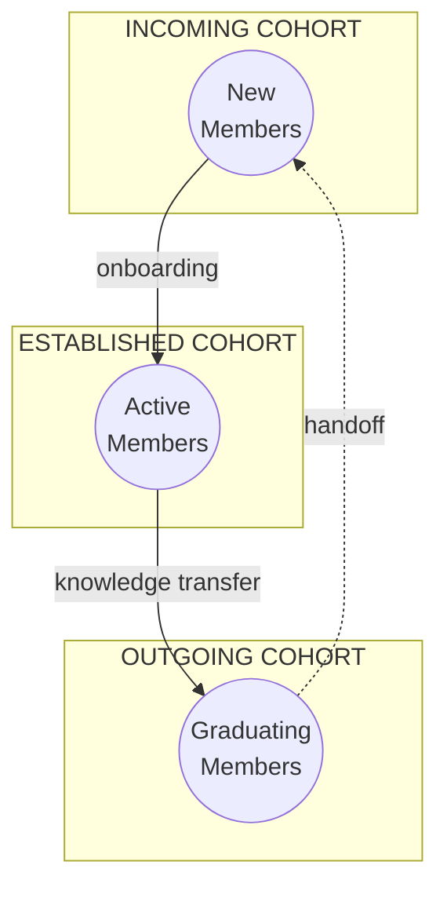
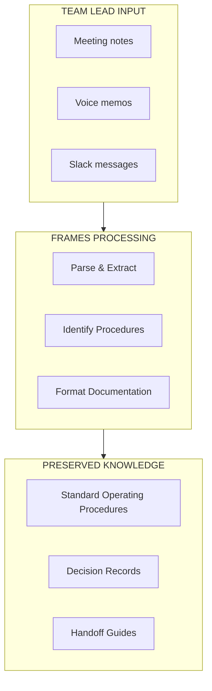

FRAMES helps program administrators **identify and address organizational vulnerabilities** before they cause mission failure. This page describes how FRAMES supports program continuity, knowledge transfer, and risk management.

---

## The Problem

University engineering programs face persistent structural challenges:

| Challenge | Impact |
|-----------|--------|
| **Knowledge Loss** | Critical expertise disappears every semester with graduating students |
| **Weak Interfaces** | Connections between subsystems degrade without active maintenance |
| **Temporal Misalignment** | Academic calendars don't match project timelines |
| **Classification Gaps** | Programs operate in boundary spaces without clear institutional support |

88% of university CubeSat programs fail to persist long enough to achieve mission success. These failures are structural, not technical.

---

## What FRAMES Provides

### Organizational Mapping

FRAMES instruments your program to visualize:

- **Who holds critical knowledge** — Identify single points of failure
- **Interface strength** — See which connections between teams are weak
- **Knowledge distribution** — Track how expertise is spread across cohorts

### Risk Prediction

The diagnostic framework identifies vulnerabilities across six dimensions:

| Dimension | What We Measure |
|-----------|-----------------|
| **Actor Autonomy** | Are teams operating too independently with conflicting objectives? |
| **Partitioned Knowledge** | Is expertise siloed without integration mechanisms? |
| **Emergent Outputs** | Are goals shifting or undefined during development? |
| **Temporal Misalignment** | Do timelines differ across teams and institutions? |
| **Integration Cost** | Is coordination effort sustainable? |
| **Coupling Degradation** | Are planned interfaces still occurring? |

### Knowledge Continuity Tools

#### Team Lead Workspace

A Notion-based workspace for team leads to:

- Document decisions and rationale
- Capture procedures as they develop
- Track handoff status across cohorts
- Flag at-risk knowledge before people leave

#### Automated Documentation

FRAMES agents help extract and preserve knowledge:

---

## What the Model Predicts

FRAMES analyzes organizational structure to predict:

| Risk Factor | What It Tells You |
|-------------|-------------------|
| **Interface fragility** | Which connections between teams will fail under stress |
| **Knowledge concentration** | Single points of failure where expertise is too centralized |
| **Transition risk** | What breaks when key people leave |
| **Subsystem isolation** | Which teams aren't communicating enough |
| **Mission success probability** | Overall likelihood given current structure |

This isn't abstract—it's actionable intelligence about where your program is vulnerable.

---

## Interface Categories

FRAMES tracks three types of interfaces:

| Interface Type | Description | Risk |
|----------------|-------------|------|
| **Concurrent** | Between active modules working in parallel | Coordination failures |
| **External** | Connecting to outside institutional modules | Dependency on external support |
| **Intergenerational** | Linking outgoing and incoming cohorts | Knowledge loss during handoffs |

Intergenerational interfaces are the most fragile—this is where knowledge transfer fails most often.

---

## Knowledge Types

Understanding what kind of knowledge is at risk helps prioritize interventions:

| Knowledge Type | Description | How to Preserve |
|----------------|-------------|-----------------|
| **Codified** | Documented, transferable independent of individuals | Documentation, repositories, design reviews |
| **Institutional** | Tacit, experience-based, held by individuals | Mentorship, overlap periods, structured handoffs |

Institutional knowledge requires **time and presence** to transfer. If a senior member graduates with no overlap with their replacement, that knowledge is lost.

---

## Getting Started

### 1. Instrument Your Program

Work with the FRAMES team to set up observation touchpoints:

- Connect Notion workspaces
- Integrate GitHub repositories  
- Establish assessment protocols

### 2. Map Your Structure

Generate an initial map of:

- All active modules (teams, cohorts, projects)
- Interfaces between modules
- Current knowledge holders

### 3. Identify Vulnerabilities

Use the six diagnostic dimensions to flag:

- Single points of failure
- Weak or degrading interfaces
- Upcoming knowledge loss events (graduations, departures)

### 4. Design Interventions

Based on findings, implement:

- Structured handoff protocols
- Documentation requirements
- Overlap periods for critical roles
- Interface reinforcement mechanisms

---

## Contact

To discuss implementing FRAMES in your program:

**Project Lead:** Elizabeth Osborn  
**Email:** [eosborn@cpp.edu](mailto:eosborn@cpp.edu)  
**Institution:** Cal Poly Pomona

