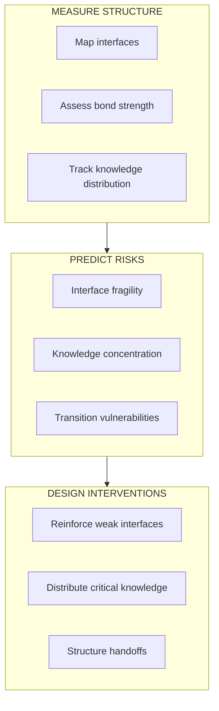
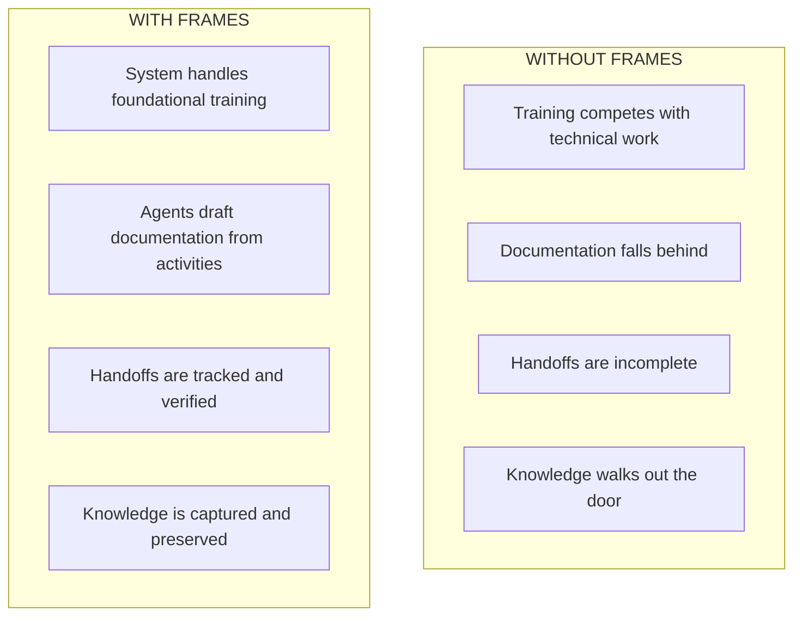
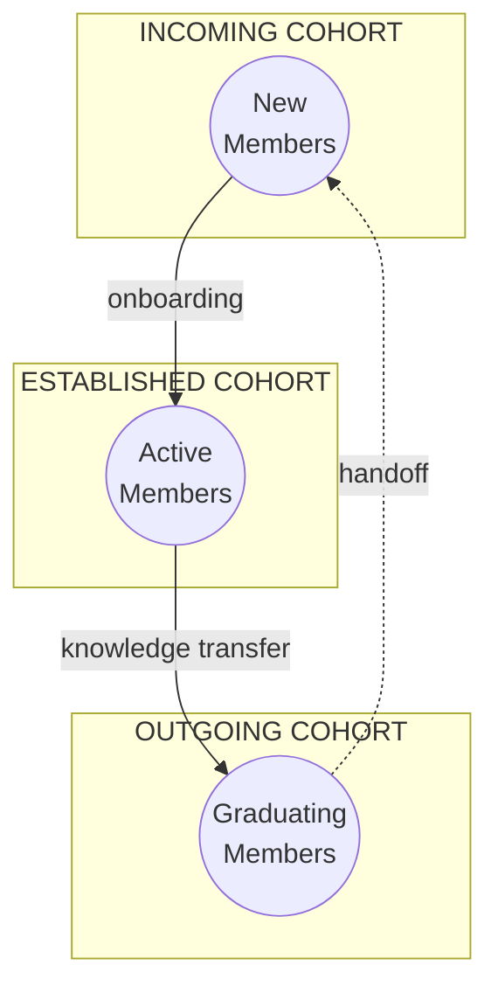

FRAMES provides program administrators with **predictive capacity, onboarding support, team lead workload reduction, and comprehensive knowledge management** for complex engineering programs.

---

## The Challenge

University engineering programs—especially those with NASA contracts—face structural challenges that cause mission failure:

| Challenge | Impact |
|-----------|--------|
| **Knowledge Loss** | Critical expertise disappears every semester with graduating students |
| **Overwhelmed Team Leads** | Technical work competes with training, documentation, and coordination |
| **Steep Learning Curves** | New members take too long to become productive |
| **Invisible Degradation** | Interface failures aren't visible until missions fail |
| **Classification Gaps** | Programs operate in boundary spaces without clear institutional support |

88% of university CubeSat programs fail to persist long enough to achieve mission success. These failures are structural, not technical.

---

## What FRAMES Provides

### 1. Predictive Capacity

Know where your program is vulnerable **before** failures occur.

The [Predictive Model](/Portfolio/predictive-model/) uses Herbert Simon's research on complex systems to identify structural risks:

| Risk Factor | What You Learn |
|-------------|----------------|
| **Interface fragility** | Which connections between teams will fail under stress |
| **Knowledge concentration** | Single points of failure—people whose departure would be catastrophic |
| **Transition risk** | What breaks when key people leave |
| **Subsystem isolation** | Which teams aren't communicating enough |
| **Mission success probability** | Overall likelihood given current structure |

[Learn more about the Predictive Model →](/Portfolio/predictive-model/)

---

### 2. Onboarding & Learning Support

Reduce time-to-productivity for new team members.

The [Onboarding System](/Portfolio/onboarding/) provides:

- **Adaptive learning paths** — Personalized to each learner's background and role
- **Scaffolded skill building** — From foundations to project-specific knowledge
- **Just-in-time support** — Information when learners need it, not all upfront
- **Competency validation** — Confirm understanding before advancing

| Before FRAMES | With FRAMES |
|---------------|-------------|
| Team leads train each person individually | Structured system handles foundational training |
| Inconsistent quality depending on trainer | Consistent, validated learning paths |
| Same questions answered repeatedly | Common questions handled systematically |
| Training competes with technical work | Team leads focus on project-specific context |

[Learn more about Onboarding →](/Portfolio/onboarding/)

---

### 3. Team Lead Workload Reduction

Stop burning out your most valuable people.

The [Team Lead Tools](/Portfolio/team-tools/) help team leads:

- **Capture knowledge without extra work** — Extract documentation from existing activities
- **Manage handoffs systematically** — Automated checklists, gap detection, verification
- **Document decisions with context** — Why, not just what
- **See risks before they hit** — Knowledge concentration, upcoming departures, weak interfaces

[Learn more about Team Lead Tools →](/Portfolio/team-tools/)

---

### 4. AI-Assisted Knowledge Management

[AI Agents](/Portfolio/agents/) reduce administrative burden while keeping humans in control:

| Agent Level | What It Does | Human Control |
|-------------|--------------|---------------|
| **Alpha** | Observes activities, recognizes patterns, generates reports | Read-only—no actions |
| **Beta** | Drafts documentation, suggests procedures, flags risks | Proposes only—humans approve |
| **Gamma** | Executes approved actions, sends notifications | Acts only with explicit approval |

**Nothing changes without human approval.** Agents propose, humans decide.

Example workflows:

- Agent notices an undocumented procedure mentioned in meeting notes → drafts SOP for review
- Agent detects knowledge concentration → flags for administrator attention
- Agent sees upcoming graduation → generates handoff checklist from member's activities

[Learn more about AI Agents →](/Portfolio/agents/)

---

## Organizational Visibility

See your program's structure clearly:

### Interface Mapping

Visualize all connections between modules:

### Dashboard Metrics

| Metric | What It Tells You |
|--------|-------------------|
| **Knowledge concentration** | Who holds critical expertise |
| **Interface health** | Which team connections are strong, which are degrading |
| **Handoff status** | Are transitions being managed |
| **Onboarding progress** | How quickly new members reach productivity |
| **Documentation coverage** | What's captured vs. what's at risk |

---

## Interface Categories

FRAMES tracks three types of interfaces:

| Interface Type | Description | Risk |
|----------------|-------------|------|
| **Concurrent** | Between active teams working in parallel | Coordination failures |
| **External** | Connecting to outside institutions | Dependency on external support |
| **Intergenerational** | Linking outgoing and incoming cohorts | Knowledge loss during handoffs |

Intergenerational interfaces are the most fragile—this is where knowledge transfer fails most often.

---

## Six Diagnostic Dimensions

Risk assessment across six dimensions:

| Dimension | What We Measure |
|-----------|-----------------|
| **Actor Autonomy** | Are teams operating too independently with conflicting objectives? |
| **Partitioned Knowledge** | Is expertise siloed without integration mechanisms? |
| **Emergent Outputs** | Are goals shifting or undefined during development? |
| **Temporal Misalignment** | Do timelines differ across teams and institutions? |
| **Integration Cost** | Is coordination effort sustainable? |
| **Coupling Degradation** | Are planned interfaces still occurring? |

---

## Getting Started

### 1. Instrument Your Program

Work with the FRAMES team to set up observation touchpoints:

- Connect Notion workspaces
- Integrate GitHub repositories  
- Establish assessment protocols

### 2. Map Your Structure

Generate an initial map of:

- All active modules (teams, cohorts, projects)
- Interfaces between modules
- Current knowledge holders

### 3. Identify Vulnerabilities

Use the six diagnostic dimensions to flag:

- Single points of failure
- Weak or degrading interfaces
- Upcoming knowledge loss events (graduations, departures)

### 4. Design Interventions

Based on findings, implement:

- Structured handoff protocols
- Documentation requirements
- Overlap periods for critical roles
- Interface reinforcement mechanisms

---

## Contact

To discuss implementing FRAMES in your program:

**Project Lead:** Elizabeth Osborn  
**Email:** [eosborn@cpp.edu](mailto:eosborn@cpp.edu)  
**Institution:** Cal Poly Pomona
