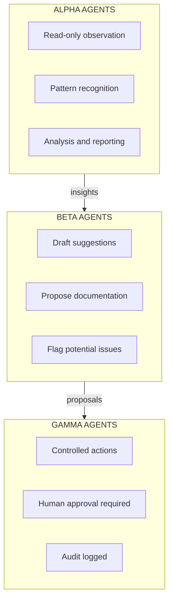
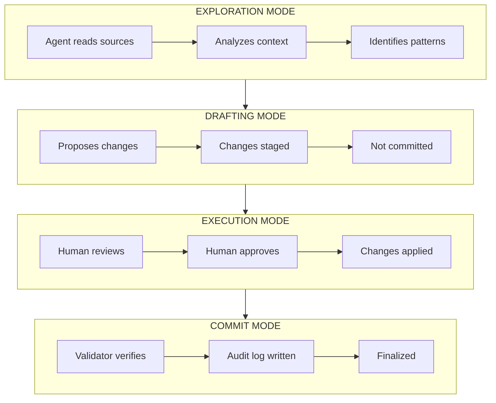
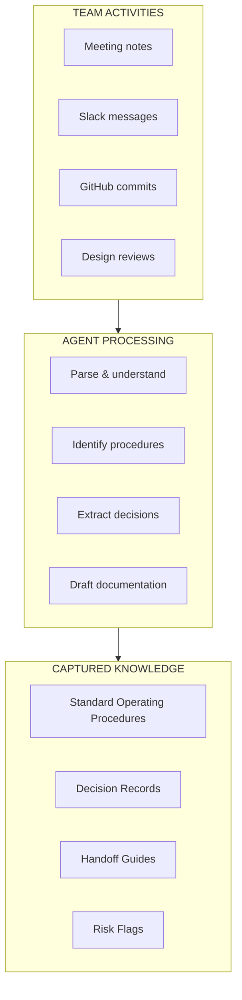

FRAMES uses AI agents to interpret team activities, support documentation, and reduce the burden on team leads—all with human oversight and control.

---

## Why Agents?

Team leads are overwhelmed. They're responsible for:

- Technical work on the mission
- Training new team members  
- Documenting decisions and procedures
- Coordinating across subsystems
- Managing handoffs as people leave

This is unsustainable. Critical knowledge goes undocumented because there's no time. Handoffs fail because capturing institutional knowledge takes effort that competes with technical work.

**FRAMES agents help by:**
- Extracting knowledge from natural team activities
- Drafting documentation for human review
- Identifying patterns and potential issues
- Reducing the administrative burden on technical leads

---

## Agent Architecture

FRAMES agents operate at three autonomy levels, with human control at every stage:

| Agent Level | Role | Autonomy | Example Actions |
|-------------|------|----------|-----------------|
| **Alpha** | Observation | None | Read documentation, analyze patterns, generate reports |
| **Beta** | Drafting | Low | Propose documentation updates, suggest procedures, flag risks |
| **Gamma** | Execution | Medium | Update records with approval, trigger notifications, schedule reminders |

---

## Workflow Orchestration

Agents follow a controlled workflow powered by LangGraph:

**Nothing changes without human approval.** Agents propose, humans decide.

---

## What Agents Do

### Knowledge Extraction

Agents read team activities and extract knowledge that would otherwise go undocumented:

### Risk Detection

Alpha agents continuously monitor for structural risks:

- Knowledge concentrating in too few people
- Interfaces that haven't been active recently
- Upcoming departures without handoff plans
- Siloed expertise with no documentation

### Documentation Support

Beta agents draft documentation based on observed activities:

- Convert meeting notes into structured procedures
- Propose updates to existing documentation when practices change
- Generate handoff checklists based on departing member's activities
- Create onboarding guides based on common questions

---

## MCP Server Integration

Agents access external systems through Model Context Protocol (MCP) servers—secure, controlled connections:

| MCP Server | Purpose | Access Level |
|------------|---------|--------------|
| **Notion** | Read team workspaces, documentation | Read-only |
| **GitHub** | Read repositories, issues, commits | Read-only |
| **PostgreSQL** | Database operations | Gated—requires approval |
| **Filesystem** | Access local resources | Controlled |

---

## Human Oversight

Every agent action is:

1. **Logged** — Full audit trail of what was read, analyzed, and proposed
2. **Staged** — Changes sit in draft until human review
3. **Approved** — Humans decide what gets committed
4. **Traceable** — Every change links back to the agent action that proposed it

Agents are tools to reduce burden, not replacements for human judgment.

---

## Use Cases

### For Team Leads

- Let agents draft documentation from your meeting notes
- Get alerts when knowledge is concentrating in one person
- Generate handoff checklists automatically when team members leave

[Learn more about Team Lead Tools →](/Portfolio/team-tools/)

### For Administrators

- See aggregated risk patterns across teams
- Monitor interface health without adding burden to teams
- Get early warning of structural vulnerabilities

[Learn more about FRAMES for Administrators →](/Portfolio/administrators/)

### For Researchers

- Study how AI assistance affects knowledge retention
- Analyze agent-generated documentation patterns
- Compare team performance with and without agent support

[Learn more about FRAMES for Researchers →](/Portfolio/researchers/)

---

## Technical Details

For implementation details, API documentation, and integration guides:

[See Technical Documentation →](/Portfolio/technical/)
