FRAMES provides three distinct applications, each designed for a specific stakeholder group. Together, they form a comprehensive ecosystem for learning, coordination, and research.

---

## Student Learning Management System

**For:** Individual contributors and new team members  
**Technology:** React 18+ Progressive Web App

### Overview

The Student LMS is the primary interface for learners joining university engineering programs. It provides structured onboarding through modules built from real project experiences.

### Key Features

#### Personalized Learning Paths

- **Adaptive progression** — Content adjusts to demonstrated competency
- **Multiple tracks** — Paths for different roles (software, hardware, systems)
- **Clear milestones** — Visible progress toward team readiness

#### Module Structure

Each learning module follows a consistent pedagogical approach:

**Learning Objectives** → **Core Content** → **Hint System** → **Knowledge Checks** → **Completion**

| Component | Description |
|-----------|-------------|
| **Learning Objectives** | Clear goals for what students will master |
| **Core Content** | Concepts, real-world context from actual projects, worked examples |
| **Hint System** | Progressive hints, scaffolded support, "ask for help" integration |
| **Knowledge Checks** | Self-assessment, practical exercises, scenario challenges |
| **Module Completion** | Competency badge, recommended next modules |

#### Research-Backed Pedagogy

The LMS incorporates principles from **OATutor** research:

- **Scaffolding** — Complex tasks broken into manageable steps
- **Hint pathways** — Support available but not intrusive
- **Validation** — Confirm understanding before advancing
- **Spaced practice** — Review and reinforcement over time

#### Offline Capability

As a Progressive Web App (PWA), students can:

- Download modules for offline study
- Work without internet connectivity
- Sync progress when reconnected
- Receive push notifications for updates

### User Experience

The student dashboard provides:

| Feature | Description |
|---------|-------------|
| **Progress Tracker** | Visual progress bar showing completion percentage |
| **Current Module** | Active learning module with time estimate |
| **Achievements** | Completed modules and competency badges |
| **Schedule** | Upcoming lab sessions and reviews |
| **Continue Learning** | One-click return to where you left off |

---

## Team Lead Workspace

**For:** Team leads and project managers
**Technology:** Notion with custom integrations

### The Problem FRAMES Solves for Team Leads

Team leads in university space labs face an impossible cycle: every semester, students rotate out and new ones arrive. Leads spend enormous time onboarding, explaining the same basics, recreating documentation—time that should go toward hands-on mentorship.

**FRAMES changes this equation.** The more team leads document naturally, the smarter the system gets at handling the repetitive work.

### Key Features

#### Auto-Generated Lab SOPs

Team leads drop notes, meeting minutes, or quick voice memos. FRAMES agents extract procedures and generate formatted Standard Operating Procedures automatically:

```mermaid
flowchart LR
    subgraph INPUT["📝 Team Lead Input"]
        A["Meeting notes about thermal vacuum testing..."]
    end
    
    subgraph FRAMES["⚙️ FRAMES Processing"]
        B[Extract procedures]
        C[Format SOP]
    end
    
    subgraph OUTPUT["📄 Generated SOP"]
        D["Thermal Vacuum Testing Procedure"]
    end
    
    INPUT --> FRAMES --> OUTPUT
```



#### Automated Documentation

No more manual documentation grind:

- **Decision capture** — Meeting notes become structured records
- **Process extraction** — Procedures emerge from natural documentation
- **Knowledge preservation** — Expertise stays when students graduate
- **Handoff generation** — Auto-create transition guides for new cohorts

#### Mission Planning

- **Template library** — Pre-built structures for common mission types
- **Milestone tracking** — Clear phase gates and deliverables
- **Resource allocation** — Team capacity and assignments
- **Risk registers** — Tracked concerns with mitigation plans

#### The Goal: Free Up Team Leads

As the Space Lab Predictive Model learns from real outcomes:

| What Gets Automated | What Team Leads Focus On |
|---------------------|--------------------------|
| Routine onboarding content | High-touch mentorship moments |
| SOP documentation | Hands-on lab guidance |
| Progress tracking | Connecting with struggling students |
| Basic Q&A | Complex problem-solving discussions |
| Administrative overhead | Building relationships |

**The vision:** Team leads do what only humans can do—connect with students, guide projects, share expertise. FRAMES handles the rest.

#### Cross-Team Visibility

Real-time dashboards show status across all teams without manual status updates.

#### Integration Points

- **GitHub** — Code repository sync
- **Slack** — Notifications and updates
- **Calendar** — Meeting and deadline sync
- **Notion** — Native workspace integration

---

## Researcher Platform

**For:** Faculty, graduate students, and research staff
**Technology:** MLflow + Jupyter + Analytics Dashboard

### Overview

The Researcher Platform provides secure, ethical access to FRAMES data for studying collaboration, learning, and organizational dynamics. It also serves as the hub for ML experimentation and model development.

### Key Components

#### MLflow Experiment Tracking

The centerpiece for reproducible research and ML workflows:

- **Experiment tracking** — Full provenance for all runs
- **Model registry** — Version control for trained models
- **A/B testing** — Compare model variants in production
- **Artifact storage** — Datasets, parameters, metrics
- **Collaboration** — Share findings across research teams

#### Jupyter Notebooks

Pre-configured environments for data analysis:

- **Python 3.9+** with scientific stack
- **Pandas, NumPy, SciPy** for data manipulation
- **Matplotlib, Seaborn, Plotly** for visualization
- **scikit-learn, PyTorch** for modeling
- **LangChain integration** for agent experimentation

#### Analytics Dashboard

Interactive visualizations for:

- Collaboration patterns
- Learning analytics
- Cross-institutional comparisons
- Longitudinal trends

### ML Pipeline Access

Researchers can experiment with and contribute to the FRAMES ML pipeline:

```python
# Load the current production model
import mlflow
model = mlflow.sklearn.load_model("models:/frames_module_recommender/production")

# Run predictions on student engagement features
features = frames.get_student_features(student_hash="abc123")
recommendations = model.predict(features)

# Track your own experiments
with mlflow.start_run(experiment_name="module_optimization"):
    # Train custom model variant
    custom_model = train_custom_model(training_data)
    
    # Log parameters, metrics, artifacts
    mlflow.log_params({"learning_rate": 0.01, "n_estimators": 100})
    mlflow.log_metrics({"accuracy": 0.87, "f1_score": 0.84})
    mlflow.sklearn.log_model(custom_model, "model")
```

### Prediction API

Researchers can access model predictions through a dedicated API:

| Endpoint | Purpose |
|----------|---------|
| `/ml/predict/module` | Next module recommendations |
| `/ml/predict/outcome` | Student success probability |
| `/ml/predict/engagement` | Content engagement score |
| `/ml/features/{student}` | Feature vector for a student |

### Data Access Principles

**Privacy First:**

- Data anonymized by default
- IRB-approved access protocols
- Role-based permissions
- Audit logging of all queries

**Research Ethics:**

- Clear data use agreements
- Student consent framework
- Institutional data ownership
- Publication guidelines

### Example Research Queries

```python
# Collaboration Network Analysis
collaboration_data = frames.query("""
    SELECT 
        team_id,
        interaction_type,
        timestamp,
        -- Anonymized participant IDs
        participant_hash
    FROM interactions
    WHERE institution = :institution
    AND date BETWEEN :start AND :end
""", params={...})

# Learning Path Effectiveness
module_performance = frames.query("""
    SELECT 
        module_id,
        avg(completion_rate) as avg_completion,
        avg(time_to_complete) as avg_time,
        count(distinct user_hash) as learners
    FROM learning_events
    GROUP BY module_id
""")
```

### Available Datasets

| Dataset | Description | Access Level |
|---------|-------------|--------------|
| **Learning Events** | Module completion, hints, assessments | Anonymized |
| **Collaboration Patterns** | Team interaction frequencies | Aggregated |
| **Project Outcomes** | Mission completion, quality metrics | Aggregated |
| **Survey Responses** | Self-reported data (consented) | IRB Approved |
| **ML Training Data** | Engineered features for model training | Researcher Access |
| **Model Artifacts** | Trained models and evaluation metrics | MLflow Registry |

---

## Application Integration

The three applications work together through the shared canonical data layer:

```mermaid
flowchart TB
    subgraph APPS["📱 Applications"]
        S[Student LMS]
        T[Team Lead Workspace]
        R[Researcher Platform]
    end
    
    API["🔐 FRAMES API Layer<br/>Authentication, RBAC"]
    
    subgraph DATA["💾 Data Layer"]
        DB[(Canonical Database)]
        ML[ML Pipeline + MLflow]
    end
    
    S --> API
    T --> API
    R --> API
    API --> DATA
```



### Data Flow Examples

**Student completes module:**

1. LMS records completion → Database
2. ML pipeline updates feature store
3. Researcher Platform sees analytics update
4. Team Lead dashboard shows team readiness

**Team Lead documents decision:**

1. Notion entry → Agent processing → Database
2. LMS receives new context for relevant modules
3. ML pipeline retrains on new data (scheduled)
4. Researcher Platform has new collaboration data

---

## Learn More

- [Architecture]({{ site.baseurl }}/architecture) — Technical deep dive
- [Documentation]({{ site.baseurl }}/documentation) — Developer resources
- [About]({{ site.baseurl }}/about) — Project background
