FRAMES is a research platform for developing **predictive models of organizational mission success**. The architecture is designed to instrument complex engineering teams, map their organizational structure, and identify risk factors that predict success or failure.

University space labs serve as the research environment. The insights apply to any organization undertaking complex emergent technology missions.

---

## The Six-Layer Model

```mermaid
flowchart TB
    subgraph RW["🌐 REAL WORLD LAYER"]
        A[Actual engineering team activities]
    end
    
    subgraph DO["📡 DIGITAL OBSERVATION LAYER"]
        B[Notion workspaces · GitHub · Manual entry]
    end
    
    subgraph INT["🤖 INTERPRETATION / AGENT LAYER"]
        C[LangChain · LangGraph · MCP servers]
    end
    
    subgraph CAN["💾 CANONICAL DATA LAYER"]
        D[Neon PostgreSQL · 37+ Tables]
    end
    
    subgraph APP["📱 APPLICATION LAYER"]
        E[Student LMS]
        F[Team Tools]
        G[Research Platform]
    end
    
    subgraph GOV["🔒 GOVERNANCE LAYER"]
        H[Audit trails · FERPA · Risk management]
    end
    
    RW --> DO --> INT --> CAN --> APP
    APP --> GOV
```



---

## Layer 1: Real World Layer

**Purpose:** Where authentic engineering activities occur

This layer represents actual project work as it happens—design reviews, code commits, team meetings, and technical decisions. FRAMES observes this layer without interfering with natural workflows.

---

## Layer 2: Digital Observation Layer

**Purpose:** Capture team activities through digital touchpoints

Team leads and members document their work using familiar tools. The key principle is **minimal friction**—teams work naturally while FRAMES captures structured and unstructured data.

**Data Sources:**

- **Notion workspaces** — Mission documentation, meeting notes, decisions
- **GitHub repositories** — Code commits, pull requests, issues
- **Manual entry** — Structured forms for specific data points
- **LlamaIndex integration** — Content indexing for semantic search (planned)

**Design Philosophy:** FRAMES adapts to teams, not the other way around.

---

## Layer 3: Interpretation / Agent Layer

**Purpose:** Transform observations into structured, actionable data

This layer employs a multi-agent system orchestrated through **LangChain** with **LangGraph** for workflow state management. Agents operate with risk-based autonomy levels.

### Agent Architecture

Three specialized roles with distinct responsibilities:

#### The Interpreter

Analyzes incoming data to identify:

- Key decisions and their rationale
- Technical specifications and requirements
- Task assignments and dependencies
- Risk factors and concerns

**Autonomy Level:** High — can read and analyze without human approval

#### The Builder

Constructs and modifies system artifacts:

- Creates new database records
- Links information across domains
- Generates learning module content
- Updates cross-team relationships

**Autonomy Level:** Medium — requires human approval for significant changes

#### The Validator

Ensures data quality and system consistency:

- Consistency and completeness checking
- Conflict detection and resolution
- FERPA compliance verification
- Human review queue management

**Autonomy Level:** Low — flags issues for human decision

### Workflow Orchestration (LangGraph)


### MCP Server Integration (LangChain)

Model Context Protocol servers provide secure, controlled access to external systems:

| MCP Server | Purpose | Risk Surface |
|------------|---------|--------------|
| **Notion** | Read team documentation | Low |
| **GitHub** | Read repositories, issues | Low |
| **Filesystem** | Access local resources | Medium |
| **PostgreSQL** | Database operations | High (gated) |

**Safety Principles:**

- All operations logged to governance layer
- Risk-based approval workflows
- No autonomous changes to production data without human approval
- Circuit breakers for runaway operations

---

## Layer 4: Canonical Data Layer

**Purpose:** Single source of truth for all FRAMES data

### Database Architecture

FRAMES uses **Neon PostgreSQL** with 37+ tables organized into logical domains:

#### Core Domains

| Domain | Tables | Purpose |
|--------|--------|---------|
| **Organizations** | universities, teams, programs | Institutional structure |
| **People** | users, roles, permissions | Identity and access |
| **Missions** | missions, phases, milestones | Project tracking |
| **Learning** | modules, steps, assessments | Educational content |
| **Analytics** | events, metrics, reports | Research data |
| **ML Pipeline** | training_data, model_versions, predictions | Machine learning |

#### Key Schema Features

- **Temporal tracking** — All entities track creation/modification times
- **Soft deletion** — Records marked inactive, never truly deleted
- **Audit logging** — Every change recorded for research and compliance
- **Flexible metadata** — JSONB fields for evolving requirements
- **ML-ready** — Feature columns optimized for model training

### Data Flow Principles


---

## Layer 5: Application Layer

Three distinct applications serve different stakeholder needs:

### Student Learning Management System

**Technology:** React 18+ PWA
**Purpose:** Personalized learning for individual contributors

Features:

- Module-based learning paths generated from team activities
- Progress tracking and visualization
- Adaptive hint systems and scaffolding
- Assessment and competency validation
- Offline capability (Progressive Web App)

### Team Lead Workspace

**Technology:** Notion + Integrations
**Purpose:** Mission coordination and documentation

Features:

- Mission planning templates
- Real-time status dashboards
- Cross-team visibility
- Automated progress reporting
- Bi-directional sync with FRAMES

### Researcher Platform

**Technology:** MLflow + Jupyter + Analytics Dashboard
**Purpose:** Data analysis, ML experimentation, and research workflows

Features:

- Secure data access (anonymized by default)
- Pre-built analysis notebooks
- MLflow experiment tracking and model registry
- Prediction API for module recommendations
- Visualization dashboards
- Export tools for publication

---

## The Space Lab Predictive Model

This is the core innovation of FRAMES. Rather than generic AI, we're building a model grounded in **Herbert Simon's molecular model of organizational structure**—predicting mission success based on where knowledge is vulnerable and which interfaces are at risk.

### The Molecular Model (Simon's Theory in Practice)

Teams are modeled as molecular structures:

- **Nodes** — Individual team members holding localized knowledge
- **Bonds** — Interfaces between people (communication, handoffs, dependencies)
- **Bond strength** — Measured by frequency, reciprocity, error recovery
- **Subsystems** — Functional clusters (power, comms, software) with strong internal bonds

When a student graduates, they don't just remove a node—they **break bonds**. The model predicts which bond breaks will cause structural failure.

### What the Model Learns From

| Data Source | What It Teaches the Model |
|-------------|---------------------------|
| **Interface patterns** | Which connections are strong vs. fragile |
| **Knowledge distribution** | Where expertise is concentrated or distributed |
| **Handoff success rates** | Which subsystem boundaries are working |
| **Historical mission outcomes** | What organizational structures led to success/failure |
| **Cohort transitions** | What happens when students rotate out |

### What the Model Predicts

```mermaid
flowchart TB
    INPUT["📥 INPUT<br/>Current team structure, interface map, upcoming graduations"]
    
    MODEL["🧠 SPACE LAB PREDICTIVE MODEL"]
    
    subgraph OUTPUT["📤 OUTPUT"]
        O1["Knowledge concentration risk: 80% of thermal expertise in one student"]
        O2["Interface weakness: Power-Comms handoffs failing 40%"]
        O3["Graduation risk: 3 critical interfaces break next semester"]
        O4["Mission success probability: 67%"]
    end
    
    INPUT --> MODEL --> OUTPUT
```



### Why This Matters for Team Leads

| Without FRAMES | With FRAMES |
|----------------|-------------|
| "We lost Sarah and now nobody knows thermal" | "Sarah's graduation will break 2 critical interfaces—document now" |
| "The project stalled and we don't know why" | "Power-Comms interface strength dropped 60% last month" |
| "New students take forever to ramp up" | "Onboarding priority: rebuild interfaces to avionics subsystem" |

### The Agents Map the Structure

The three agents (Interpreter, Builder, Validator) don't make predictions—they map the organizational topology:

```mermaid
flowchart TB
    RW["🌐 REAL WORLD ACTIVITY<br/>Team members communicate, hand off work, make decisions"]
    
    INT["🔍 INTERPRETER AGENT<br/>Identifies: who talks to whom, what flows across interfaces"]
    
    BUILD["🏗️ BUILDER AGENT<br/>Constructs: interface map, bond strength, knowledge distribution"]
    
    VAL["✅ VALIDATOR AGENT<br/>Checks: consistency, completeness, flags anomalies"]
    
    ORG["📊 ORGANIZATIONAL MODEL<br/>Feeds the Space Lab Predictive Model"]
    
    RISK["⚠️ RISK PREDICTIONS<br/>73% mission success probability; here's what's weak"]
    
    RW --> INT --> BUILD --> VAL --> ORG --> RISK
```



---

## Technology Stack

### Backend

| Technology | Version | Purpose |
|------------|---------|---------|
| **Python** | 3.9+ | Primary language |
| **Flask** | 3.0+ | API framework |
| **SQLAlchemy** | 2.0+ | ORM |
| **Celery** | 5.3+ | Task queue |
| **Redis** | 7+ | Caching |

### Frontend

| Technology | Version | Purpose |
|------------|---------|---------|
| **React** | 18+ | UI framework |
| **TypeScript** | 5+ | Type safety |
| **TanStack Query** | 5+ | Data fetching |
| **Tailwind CSS** | 3+ | Styling |

### Data and Infrastructure

| Technology | Version | Purpose |
|------------|---------|---------|
| **PostgreSQL** | 15+ | Primary database |
| **Neon** | — | Serverless Postgres |
| **Docker** | 24+ | Containerization |
| **GitHub Actions** | — | CI/CD |

### AI, ML, and Analytics

| Technology | Purpose |
|------------|---------|
| **LangChain** | Agent orchestration, MCP server integration |
| **LangGraph** | Workflow state management |
| **LlamaIndex** | Content indexing (Notion integration) |
| **MLflow** | Experiment tracking, model registry |
| **scikit-learn / PyTorch** | Model training |
| **Custom ML Model** | Domain-specific predictions (in development) |

---

## Layer 6: Governance and Logging Layer

**Purpose:** Ensure compliance, auditability, and risk management

### Compliance Framework

FRAMES handles educational data subject to FERPA and institutional policies:

| Requirement | Implementation |
|-------------|----------------|
| **FERPA Compliance** | Student data anonymization, access logging |
| **Audit Trails** | Every operation logged with timestamp, actor, action |
| **Data Retention** | Configurable retention policies per data type |
| **Access Control** | Role-based permissions, university isolation |

### Risk-Based Agent Autonomy

Agent operations are classified by risk level:

| Risk Level | Examples | Approval Required |
|------------|----------|-------------------|
| **Low** | Reading docs, generating reports | None |
| **Medium** | Creating draft records, suggestions | Human review |
| **High** | Modifying production data, bulk operations | Explicit approval |

### Logging Architecture


---

## Security Architecture

### Authentication and Authorization

- OAuth 2.0 / OIDC integration with university identity providers
- Role-based access control (RBAC) with granular permissions
- Per-university data isolation (multi-tenant)
- API key management for integrations
- Session management with secure token handling

### Data Protection

- Encryption at rest (AES-256)
- Encryption in transit (TLS 1.3)
- Automated PII detection and handling
- SQL injection prevention (parameterized queries)
- XSS protection (Content Security Policy)
- Regular security audits

### AI Safety Controls

- Sandboxed agent execution environments
- Rate limiting and circuit breakers
- Human-in-the-loop for sensitive operations
- Comprehensive audit logging of all agent actions
- Rollback capability for agent-initiated changes

---

## API Architecture

The FRAMES API follows RESTful principles with 50+ endpoints organized by resource:

```text
/api/v1/
├── /auth           # Authentication
├── /users          # User management
├── /teams          # Team operations
├── /missions       # Mission tracking
├── /modules        # Learning content
├── /assessments    # Evaluations
├── /analytics      # Research queries
├── /agents         # AI operations
├── /ml             # Model predictions (new)
└── /governance     # Audit and compliance
```

**API Features:**

- OpenAPI 3.0 specification
- JWT authentication
- Rate limiting per client
- Comprehensive error responses
- Pagination and filtering

---

## Data Flow Example

Here's how information flows through FRAMES when a team lead documents a design decision:

1. **Capture:** Team lead writes decision in Notion
2. **Detect:** Webhook notifies FRAMES of new content
3. **Index:** LlamaIndex processes content for semantic search
4. **Interpret:** Interpreter agent identifies decision elements
5. **Build:** Builder agent proposes database updates (staged)
6. **Validate:** Validator agent checks consistency, FERPA compliance
7. **Approve:** Human reviews and approves changes (if medium/high risk)
8. **Store:** Validated data written to PostgreSQL
9. **Log:** Governance layer records complete audit trail
10. **Distribute:**
    - Student LMS receives new learning context
    - ML pipeline updates training features
    - Dashboards reflect fresh data
    - Analytics available for research

---

## Learn More

- [Applications]({{ site.baseurl }}/applications) — User-facing platforms in detail
- [Documentation]({{ site.baseurl }}/documentation) — Developer resources
- [About]({{ site.baseurl }}/about) — Project background and team
