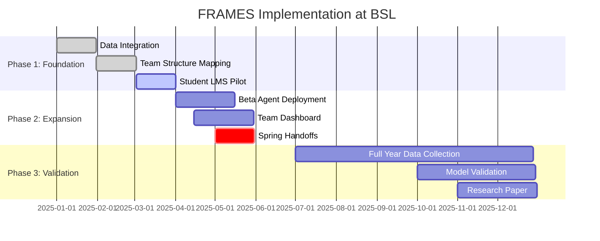

<a href="/Portfolio/bronco-demo/architecture/">← 3. Architecture</a> | <strong>4. Implementation</strong> | <a href="/Portfolio/bronco-demo/approval/">5. Next Steps →</a>

---

# Implementation Roadmap for Bronco Space Lab

Three-phase deployment over 12 months with clear milestones, resource requirements, and validation checkpoints.

---

## Phase Overview

---

## Phase 1: Foundation (Months 1-3)

**Goal:** Integrate BSL data, map current structure, deploy onboarding pilot.

### Month 1: Data Integration

**Activities:**
- Set up Neon PostgreSQL database (schema deployment)
- Configure MCP servers for Notion + GitHub read access
- Import BSL organizational structure
- Migrate existing documentation

**Deliverables:**
- Database operational with BSL data
- Alpha agent reading Notion workspace and GitHub repos
- Initial team structure map generated

**Resources Required:**
- API access credentials (Notion + GitHub admin provides)
- 1 technical lead (Elizabeth Osborn, 20 hrs)
- Database hosting ($20/month)

---

### Month 2: Team Structure Mapping

**Activities:**
- Map all subsystems and interfaces
- Identify current team members and roles
- Document knowledge distribution (who knows what)
- Establish baseline interface health scores

**Deliverables:**
- Complete BSL organizational map in database
- Interface health dashboard (first version)
- Baseline risk assessment report for lab director

**Resources Required:**
- 2 hours with each subsystem lead (interviews)
- 1 grad student for data validation (20 hrs/week)
- Faculty advisor review time (2 hrs)

**Example Output:**

| Subsystem | Members | Critical Interfaces | Risk Level |
|-----------|---------|---------------------|------------|
| **ADCS** | 3 students | ADCS ↔ CDH, ADCS ↔ Power | Medium |
| **Power** | 2 students | Power ↔ All subsystems | High (knowledge concentration) |
| **Comms** | 2 students | Comms ↔ CDH, Comms ↔ NASA | Medium |
| **CDH** | 3 students | Hub interface (all subsystems) | High (critical path) |
| **Systems Eng** | 2 students | All subsystems | Medium |

---

### Month 3: Student LMS Pilot

**Activities:**
- Deploy React PWA frontend
- Create initial learning modules (foundational content)
- Pilot with one subsystem (e.g., Power team)
- Gather feedback, iterate

**Deliverables:**
- Student LMS accessible to pilot cohort
- 3-5 foundational modules completed
- Pilot feedback report
- Refinement plan for Phase 2 expansion

**Resources Required:**
- Content creation (existing BSL documentation + 40 hrs development)
- Frontend developer (Elizabeth + 1 grad student, 40 hrs combined)
- Beta testers (2 students, 10 hrs each)

**Pilot Metrics:**
- Time to complete foundational modules
- Quiz pass rates
- User satisfaction (survey)
- Identified gaps in content

---

## Phase 1 Budget & ROI

| Item | Cost |
|------|------|
| **Database Hosting** (3 months) | $60 |
| **OpenAI API Credits** | $300 |
| **Grad Student Time** (20 hrs/week × 12 weeks × $25/hr) | $6,000 |
| **Faculty Time** (in-kind) | — |
| **Frontend Development** (in-kind / Elizabeth's time) | — |
| **Total Phase 1** | **~$6,400** |

**Expected Outcomes by End of Phase 1:**
- BSL structure fully mapped
- First risk assessment identifying vulnerabilities
- Pilot cohort onboarding time reduced from 8 weeks → 5 weeks
- 5-10 hours of team lead time saved per week

**Early ROI Signal:**
If pilot shows promise (reduced onboarding time, positive feedback), justify Phase 2 investment.

---

## Phase 2: Expansion (Months 4-6)

**Goal:** Deploy Beta agents, build team dashboard, manage Spring 2025 handoffs.

### Month 4: Beta Agent Deployment

**Activities:**
- Implement human review workflow
- Configure Beta agent to draft documentation
- Train team leads on review process
- Monitor for errors, tune prompts

**Deliverables:**
- Beta agent operational with approval gates
- At least 5 SOPs drafted and approved
- Review workflow documented

**Resources Required:**
- Front-end developer (15 hrs/week for approval UI)
- Team lead training (2 hours)
- OpenAI API increased usage ($200/month)

---

### Month 5: Team Dashboard

**Activities:**
- Build risk visualization dashboard
- Integrate interface health scores
- Add knowledge concentration alerts
- Deploy to lab director + program manager

**Deliverables:**
- Dashboard accessible to leadership
- Real-time risk updates
- Alert system for high-risk conditions

**Resources Required:**
- Frontend developer (20 hrs/week)
- Design mockups (Figma, 10 hrs)
- User testing with lab director (2 hrs)

**Dashboard Widgets:**

1. **Risk Heat Map**
   - Visual: Color-coded interface connections
   - Data: Six diagnostic dimension scores per interface
   - Alert: Interfaces scoring >7 flagged red

2. **Knowledge Concentration**
   - Visual: Network graph showing expertise distribution
   - Data: Who holds unique knowledge
   - Alert: Single points of failure highlighted

3. **Upcoming Transitions**
   - Visual: Timeline with departures
   - Data: Graduation dates + handoff status
   - Alert: Departures within 6 weeks without plan

4. **Mission Success Probability**
   - Visual: Gauge with trend arrow
   - Data: Calculated from interface health + knowledge continuity
   - Alert: Drops below threshold (e.g., 70%)

---

### Month 6: Spring 2025 Handoffs

**Activities:**
- Identify graduating seniors
- Generate handoff checklists per subsystem
- Schedule knowledge transfer sessions
- Verify handoffs completed

**Deliverables:**
- All Spring 2025 handoffs managed by system
- Verification reports for each transition
- Post-handoff survey (confidence of successors)

**Resources Required:**
- Team lead coordination (5 hrs/week × 4 weeks)
- Graduating student overlap time (built into academic calendar)
- Beta agent drafting handoff content

**Example Handoff Checklist (CDH Lead):**

- [ ] Architecture overview walkthrough (2 hrs)
- [ ] Flight software repo tour (1 hr)
- [ ] Critical interfaces review (ADCS, Power, Comms connections) (2 hrs)
- [ ] Design decision context (why we chose this approach) (1 hr)
- [ ] NASA requirements flow (how changes propagate) (1 hr)
- [ ] Hands-on supervised task (debug session) (2 hrs)
- [ ] Reverse mentoring (successor teaches back) (1 hr)
- [ ] Verification quiz (30 min)
- [ ] Sign-off approval

---

## Phase 2 Budget & ROI

| Item | Cost |
|------|------|
| **Database + API** (3 months) | $660 |
| **Frontend Developer** (15-20 hrs/week × 12 weeks × $50/hr) | $10,800 |
| **Grad Student Support** (continued, 20 hrs/week × 12 weeks × $25/hr) | $6,000 |
| **Total Phase 2** | **~$17,500** |
| **Cumulative (Phase 1 + 2)** | **~$24,000** |

**Expected Outcomes by End of Phase 2:**
- All Spring 2025 handoffs structured and verified
- Team dashboard operational with real-time risk alerts
- Beta agent drafting 10+ documentation artifacts
- Team lead time saved: 10 hrs/week → 3 hrs/week (70% reduction)

**ROI Analysis:**
- Team lead time saved: 7 hrs/week × 16 weeks × $75/hr (loaded cost) = **$8,400 value**
- Avoided schedule slips: 1 prevented 6-week delay = **$15-30K value** (rework + reputation)
- Knowledge retention: Estimated **20% improvement** in continuity

**Cumulative Value:** $25-40K, break-even by end of Phase 2.

---

## Phase 3: Validation (Months 7-12)

**Goal:** Collect full academic year data, validate predictive model, publish research.

### Months 7-9: Data Collection

**Activities:**
- Monitor Fall 2025 semester operations
- Track predictions vs. actual outcomes
- Gather user feedback (surveys, interviews)
- Iterate on LMS content and dashboard

**Deliverables:**
- Two full semesters of data (Spring + Fall 2025)
- Prediction accuracy metrics
- User satisfaction reports

---

### Months 10-11: Model Validation

**Activities:**
- Compare predicted interface failures vs. actual
- Validate mission success probability accuracy
- Statistical analysis (ROC curves, precision/recall)
- Refine scoring algorithms based on outcomes

**Deliverables:**
- Validation report (Did predictions match reality?)
- Model refinements
- Confidence intervals for future predictions

**Key Research Questions:**
- Do high-risk interfaces fail more often? (Expected: Yes)
- Does knowledge concentration predict knowledge loss? (Expected: Yes)
- Do structured handoffs improve outcomes? (Expected: Yes)
- Is mission success probability accurate? (Validate against CDR outcomes)

---

### Month 12: Research Dissemination

**Activities:**
- Write research paper for publication
- Submit to AIAA/USU Conference on Small Satellites
- Present findings to BSL stakeholders
- Plan multi-university expansion

**Deliverables:**
- Submitted paper (conference or journal)
- Stakeholder presentation
- Expansion proposal for partner universities

**Target Venues:**
- AIAA/USU Conference on Small Satellites (August 2026)
- IEEE Aerospace Conference (March 2026)
- Journal of Engineering Education

---

## Phase 3 Budget & ROI

| Item | Cost |
|------|------|
| **Database + API** (6 months) | $1,320 |
| **Grad Student Support** (reduced to 10 hrs/week × 24 weeks × $25/hr) | $6,000 |
| **Conference Travel** (1 person, 1 conference) | $2,000 |
| **Publication Fees** (open access if required) | $2,000 |
| **Total Phase 3** | **~$11,400** |
| **Total Project (All 3 Phases)** | **~$35,000** |

**Expected Outcomes by End of Phase 3:**
- Validated predictive model (accuracy metrics published)
- Research paper submitted/accepted
- BSL case study demonstrating impact
- Evidence for NSF/NASA grant proposals (~$500K-2M)

**Long-Term ROI:**
- Grant funding secured (10-50x Phase 3 investment)
- Commercial licensing opportunities
- Multi-university expansion (8 partner institutions)
- BSL becomes reference implementation

---

## Resource Summary

### Personnel

| Role | Commitment | Phase |
|------|------------|-------|
| **Project Lead** (Elizabeth Osborn) | 10-20 hrs/week | All phases |
| **Grad Student** (TBD) | 20 hrs/week (Phase 1-2), 10 hrs/week (Phase 3) | All phases |
| **Frontend Developer** (TBD or grad student) | 15-20 hrs/week | Phase 2 |
| **Faculty Advisor** (Lab Director) | 2 hrs/week review | All phases |
| **Team Leads** (BSL) | 5 hrs/week coordination | Phase 2-3 |
| **Beta Testers** (Students) | 10 hrs (one-time) | Phase 1 |

### Infrastructure

| Component | Provider | Cost |
|-----------|----------|------|
| **Database** | Neon PostgreSQL | $20/month |
| **API Credits** | OpenAI | $100-200/month |
| **Hosting** | Vercel / Railway | $0-50/month |
| **GitHub** | Existing BSL org | $0 |
| **Notion** | Existing BSL workspace | $0 |

---

## Risk Mitigation

| Risk | Likelihood | Impact | Mitigation |
|------|------------|--------|------------|
| **Student Resistance** | Low | Medium | Pilot shows value first; voluntary participation; clear benefits |
| **Technical Complexity** | Medium | Medium | Phased approach; prototype before full deployment |
| **API Cost Overruns** | Medium | Low | Monitor usage; implement caching; budget buffer |
| **Faculty Time Constraints** | High | Medium | Automate where possible; focused 2 hr/week commitment |
| **IRB Approval Delays** | Low | High | Submit protocol in Phase 1 (already in progress) |
| **Prediction Inaccuracy** | Medium | High | Phase 3 validation; iterate on model; manage expectations |

**Circuit Breakers:**
- Pause Phase 2 if Phase 1 pilot shows <30% improvement in onboarding time
- Pause Phase 3 if Phase 2 handoffs don't reduce knowledge loss
- Cap API spending at $250/month (implement rate limiting if needed)

---

## Success Criteria

### Phase 1 Success

- [ ] BSL structure fully mapped in database
- [ ] Pilot cohort onboarding time reduced by ≥30%
- [ ] Student satisfaction ≥4/5 on LMS usability
- [ ] At least one high-risk interface identified proactively

### Phase 2 Success

- [ ] All Spring 2025 handoffs completed with verification
- [ ] Team lead training burden reduced by ≥50%
- [ ] Beta agent drafts ≥10 approved documentation artifacts
- [ ] Lab director reports dashboard as useful (survey)

### Phase 3 Success

- [ ] Predictive model accuracy ≥70% (better than random)
- [ ] Research paper accepted to peer-reviewed venue
- [ ] BSL mission success rate improves (qualitative or quantitative)
- [ ] At least 1 partner university commits to deployment

---

<h3 style="margin-top: 0; color: white;">Ready to Proceed?</h3>

The final section covers decision points, approval process, and immediate next steps to launch Phase 1.

---

<a href="/Portfolio/bronco-demo/architecture/">← Previous: Architecture</a> | <a href="/Portfolio/bronco-demo/approval/" style="font-weight: bold;">Next: Approval & Next Steps →</a>

