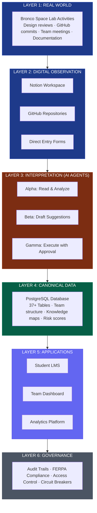
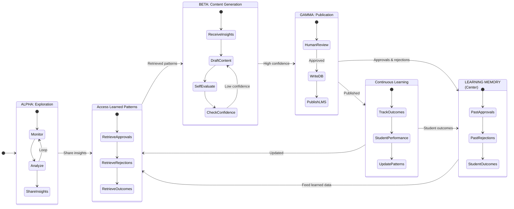
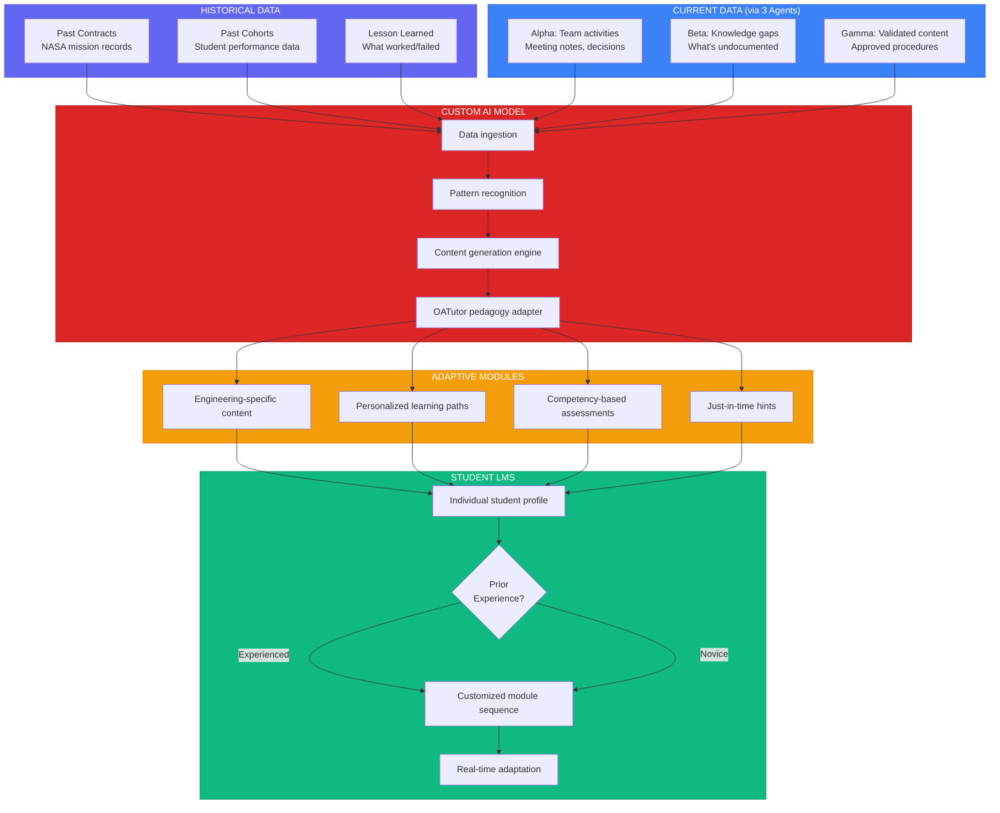
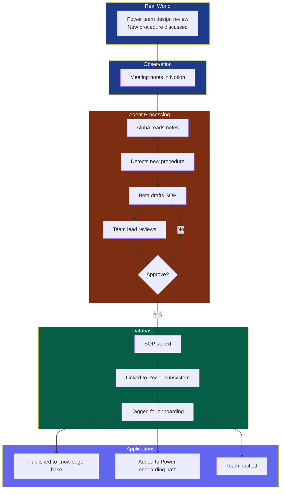

<div style="font-size: 0.9em; margin-bottom: 2em;">
<a href="/Portfolio/bronco-demo/solution/">← 2. The Solution</a> | <strong>3. Architecture</strong> | <a href="/Portfolio/bronco-demo/implementation/">4. Implementation →</a>
</div>

---

# System Architecture: How FRAMES Works

FRAMES uses a six-layer architecture to observe team activities, interpret patterns, and predict mission outcomes.

---

## Six-Layer Architecture



---

## Layer 1: Real World

**Where authentic engineering activities occur.**

BSL team members:
- Attend design reviews
- Commit code to GitHub
- Document decisions in Notion
- Hold subsystem meetings
- Transfer knowledge during handoffs

**FRAMES Observes Without Interfering:**
No change to workflows. Team works naturally. System learns from existing activities.

---

## Layer 2: Digital Observation

**Captures team activities through digital touchpoints.**

### Data Sources

| Source | What It Captures | Access Method |
|--------|------------------|---------------|
| **Notion Workspace** | Meeting notes, decisions, documentation, handoff plans | API (read-only) |
| **GitHub Organization** | Code commits, PRs, issues, collaboration patterns | API (read-only) |
| **Direct Entry** | Assessments, surveys, structured observations | Web forms |

**Privacy & Consent:**
- Students consent to research participation (IRB protocol)
- Read-only access (agents can't modify Notion/GitHub)
- FERPA-compliant data handling

---

## Layer 3: Interpretation (AI Agents)

**LangGraph-powered agents work autonomously, learn from outcomes, and collaborate—with human oversight only at publication.**

### Agent Collaboration & Learning Workflow



**How LangGraph Enables This:**

1. **Autonomous Collaboration**
   - Alpha continuously monitors without human intervention
   - Beta accesses shared memory and learned patterns
   - Agents communicate context through LangGraph state

2. **Learning from Outcomes**
   - Past approvals → Beta learns what quality looks like
   - Past rejections → Beta avoids similar mistakes
   - Student performance → System refines content generation
   - Confidence scores improve over time

3. **Strategic Human Oversight**
   - **Only at publication** (when content goes to students)
   - Not at every drafting step
   - System learns from human decisions
   - Over time, approval rate increases as agents improve

4. **Safety Through Learning, Not Gates**
   - Self-evaluation before requesting human review
   - Confidence scoring (low confidence = iterate more)
   - Memory of what works vs. what doesn't
   - Continuous improvement, not rigid rules

### Agent Workflow (LangGraph)

Four-stage process:

1. **Explore** — Agent reads sources, analyzes context
2. **Draft** — Agent proposes changes (staged, not committed)
3. **Execute** — Human reviews and approves
4. **Commit** — Validator verifies, audit log written

**Example:**
- Alpha reads weekly ADCS meeting notes
- Detects new torque rod calibration procedure
- Beta drafts SOP documentation
- Team lead reviews, makes edits, approves
- Gamma publishes to knowledge base
- New members see it in onboarding automatically

---

### How Agents Create Adaptive Learning Modules

**The agents don't just capture knowledge—they feed a custom AI model that generates personalized learning content.**



**How It Works:**

1. **Data Collection**
   - **Historical**: Past NASA contracts, previous student cohorts, documented successes/failures
   - **Current**: Three agents continuously capture team activities, identify gaps, validate new content

2. **Custom AI Model Processing**
   - Ingests both historical and real-time data
   - Recognizes patterns in how students learn engineering concepts
   - Generates content tailored to BSL's specific mission context
   - Adapts **OATutor pedagogy** (proven edtech framework) to engineering domain

3. **Module Generation**
   - Creates engineering-specific learning content (not generic tutorials)
   - Builds personalized paths based on student background
   - Generates competency-based assessments
   - Provides context-aware hints when students struggle

4. **Reactive Delivery**
   - Student logs in, system assesses prior experience
   - Model dynamically sequences modules (novice vs. experienced paths differ)
   - Real-time adaptation: if student struggles, model adjusts difficulty/hints
   - Continuous feedback loop: student performance → model refinement

**Why This Matters:**

| Traditional LMS | FRAMES Adaptive Model |
|-----------------|----------------------|
| Static content, same for everyone | Dynamic content, personalized per student |
| Generic engineering tutorials | BSL mission-specific procedures |
| Manual updates by instructors | Automated updates from live team activities |
| Fixed learning sequence | Adaptive paths based on competency |
| No context awareness | Knows current mission state, recent design decisions |

**Example: New ADCS Team Member**

1. **Model receives data:**
   - Alpha detected new magnetometer calibration procedure (current)
   - Historical data shows students struggle with quaternion math (past cohorts)
   - Beta identified gap in attitude determination documentation (current)

2. **Model generates modules:**
   - Foundations: Quaternion basics (because historical data shows struggle)
   - BSL Context: Current mission's attitude requirements (from recent design review)
   - Hands-on: Magnetometer calibration with new procedure (from Alpha's detection)
   - Assessment: Competency quiz validating understanding

3. **Delivered adaptively:**
   - Student with aerospace background: skip quaternion basics, go straight to BSL specifics
   - Student from mechanical engineering: start with math foundations, build up
   - Both paths lead to same competency, different routes based on starting point

**The Black Box (Current R&D):**

The custom AI model's internal workings are proprietary research. Key components:
- Transfer learning from general engineering → BSL-specific domain
- Reinforcement learning from student performance outcomes
- Natural language processing to convert procedures → learning content
- Pedagogical rule engine (OATutor framework) ensuring sound instructional design

---

## Layer 4: Canonical Data

**Single source of truth: Neon PostgreSQL database (37+ tables)**

### Data Model

| Domain | Tables | Purpose |
|--------|--------|---------|
| **Organizations** | universities, teams, programs, subsystems | Institutional structure |
| **People** | users, roles, permissions, cohorts | Identity and membership |
| **Missions** | missions, phases, milestones, deliverables | Project tracking |
| **Interfaces** | connections, health_scores, fragility_metrics | Relationship mapping |
| **Knowledge** | documents, procedures, expertise_areas | What people know |
| **Learning** | modules, steps, assessments, progress | Educational content |
| **Analytics** | events, predictions, outcomes, validations | Research data |

### Key Relationships

**Team Structure Map:**
```
University → Programs → Missions → Subsystems → Team Members → Roles → Expertise
```

**Interface Health:**
```
Subsystem A ↔ Subsystem B → Interface → Six Diagnostic Dimensions → Risk Score
```

**Knowledge Distribution:**
```
Team Member → Expertise Areas → Documents Created → Handoffs Completed
```

---

## Layer 5: Applications

**Three user-facing applications built on canonical data.**

### 1. Student LMS (Learning Management System)

**Target Users:** BSL team members (students)

**Features:**
- Personalized learning paths based on background and role
- Progress dashboard
- Competency validation quizzes
- Graduated hint system
- Offline-capable (PWA)

**Tech Stack:** React 18, TypeScript, PWA

**BSL Example Path:**
New ADCS team member → Assessment (prior knowledge) → Foundations (attitude determination basics) → BSL Context (current mission CDR) → ADCS Specifics (magnetometer calibration) → Hands-on (supervised task) → Validation (competency quiz) → Active contributor

---

### 2. Team Dashboard

**Target Users:** Lab director, program managers, team leads

**Features:**
- Risk visualization (which interfaces are degrading)
- Knowledge concentration alerts (single points of failure)
- Handoff status tracking
- Predicted mission success probability
- Trend analysis over time

**Metrics Displayed:**

| Widget | Information |
|--------|-------------|
| **Risk Heat Map** | Interface fragility scores (color-coded) |
| **Knowledge Map** | Who knows what; concentration indicators |
| **Upcoming Transitions** | Departures in next 3-6 months with handoff status |
| **Onboarding Pipeline** | New member progress through LMS |
| **Mission Success Gauge** | Current probability with trend arrow |

---

### 3. Analytics Platform

**Target Users:** Researchers, program evaluators

**Features:**
- Multi-semester data visualization
- Predictive model validation (predicted vs. actual outcomes)
- Interface-outcome correlations
- Cohort performance comparisons
- Export for publications

**Tech Stack:** Jupyter, MLflow, Apache Superset

---

## Layer 6: Governance

**Ensures compliance, security, and accountability.**

### Compliance

- **FERPA:** Educational data protected, consent required
- **IRB Approval:** Research protocol approved by university
- **Data Retention:** Policies for storage and deletion
- **Access Control:** Role-based permissions (students see LMS; director sees dashboard)

### Audit System

All operations logged:
- Who accessed what data when
- All agent actions (proposed and executed)
- Human approvals/rejections
- Changes to team structure or knowledge base
- Predictions made and outcomes observed

**Audit Trail Example:**
```
2025-03-15 14:23 | Alpha Agent | READ | CDH meeting notes 2025-03-12
2025-03-15 14:24 | Beta Agent | DRAFT | SOP for flight software testing
2025-03-15 16:42 | User: J.Smith | REVIEW | Edited draft, approved
2025-03-15 16:43 | Gamma Agent | WRITE | Published SOP to knowledge base
2025-03-15 16:43 | System | NOTIFY | CDH team members notified of new SOP
```

### Circuit Breakers

Automatic safeguards:
- Pause agent operations if error rate >5%
- Block writes if database health check fails
- Require additional approval for high-risk operations
- Alert lab director if critical thresholds exceeded

---

## Data Flow: End-to-End Example

**Scenario:** New power budget procedure emerges during design review



**Timeline:**
- **Day 1, 2 PM:** Design review happens
- **Day 1, 4 PM:** Notes published to Notion
- **Day 1, 6 PM:** Alpha agent processes, Beta drafts SOP
- **Day 2, 10 AM:** Team lead reviews, approves with edits
- **Day 2, 10:15 AM:** Published to knowledge base
- **Day 2, 10:16 AM:** Automatically added to next onboarding cohort's learning path

**Impact:**
- Knowledge captured within 24 hours
- No additional work for team lead (just review)
- New members see it automatically
- Prevents knowledge loss when current power team graduates

---

## Technology Stack

| Layer | Technology | Maturity | Why Chosen |
|-------|------------|----------|------------|
| **Frontend** | React 18, TypeScript | Production | Industry standard, PWA support |
| **Backend** | Flask 3.0, Python 3.9+ | Production | Rapid development, ML integration |
| **Database** | Neon PostgreSQL 15+ | Production | Serverless, scalable, relational |
| **AI/ML** | LangChain, LangGraph | Established | Agent orchestration, tool calling |
| **LLM** | OpenAI GPT-4 | Production API | Best-in-class reasoning, function calling |
| **Research** | Jupyter, MLflow, Superset | Academic standard | Data science ecosystem |
| **Infrastructure** | Docker, GitHub Actions | Production | Containerization, CI/CD |

**Cost Structure:**
- **Database:** $20/month (Neon serverless, scales with usage)
- **OpenAI API:** ~$100-200/month (estimated for BSL scale)
- **Hosting:** $50/month (frontend + backend)
- **Total:** ~$200/month operating cost

---

## Security & Privacy

### Data Protection

- **Encryption:** At rest and in transit (TLS 1.3)
- **Authentication:** OAuth 2.0 for user login
- **Authorization:** Role-based access control (RBAC)
- **API Keys:** Secure vault storage (not in code)

### Privacy Controls

- **Consent:** Students opt in to research participation
- **Anonymization:** Research datasets de-identified before export
- **Access Logging:** All data access audited
- **Right to Deletion:** Students can request data removal

---

<div style="background: #6366f1; color: white; padding: 1.5em; border-radius: 8px; margin: 2em 0;">
<h3 style="margin-top: 0; color: white;">Ready to See the Implementation Plan?</h3>
<p style="margin-bottom: 0;">The next section covers timeline, resources, budget, and phased deployment at BSL.</p>
</div>

---

<div style="text-align: center; margin-top: 3em; font-size: 1.1em;">
<a href="/Portfolio/bronco-demo/solution/">← Previous: The Solution</a> | <a href="/Portfolio/bronco-demo/implementation/" style="font-weight: bold;">Next: Implementation →</a>
</div>
