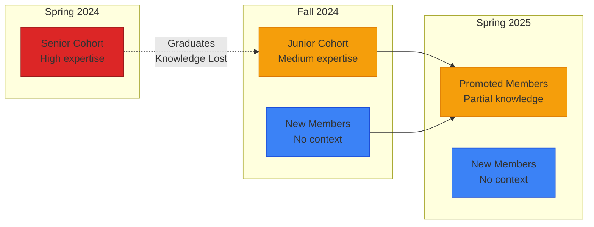

<a href="/Portfolio/bronco-demo/">← Demo Home</a> | <strong>1. The Problem</strong> | <a href="/Portfolio/bronco-demo/solution/">2. The Solution →</a>

---

# The Problem: Structural Failures in Student Space Labs

Bronco Space Lab doesn't fail because of bad engineering—it faces **structural challenges** inherent to any university program with NASA contracts and rotating students.

---

## Four Critical Challenges

### 1. Knowledge Loss from Student Rotation

**The Pattern:**
- Students join with limited context mid-mission
- They become productive after 1-2 semesters
- Just as they're most valuable, they graduate
- Critical knowledge leaves with them, undocumented

**Current Impact at BSL:**
- ~30% of institutional knowledge lost each graduation cycle
- Incoming students re-discover solutions previous cohorts already found
- Team leads spend 10+ hours/week answering the same questions repeatedly

---

### 2. Overwhelmed Team Leads

**The Reality:**
Team leads are responsible for:
- Technical work (their actual job)
- Training new members every semester
- Documentation (always behind)
- Coordination across subsystems
- Handoff planning (often forgotten until too late)

**The Math:**
- 10 hrs/week training = 140 hrs/semester
- That's 3.5 weeks of full-time engineering work lost to repetitive training

**The Consequence:**
Training competes with technical work. Technical work wins. Documentation suffers. Next cohort has even less to work with.

---

### 3. Invisible Interface Degradation

**What Are Interfaces?**
The connections between subsystems—where ADCS talks to CDH, where Power coordinates with Comms, where NASA requirements flow to the team.

**The Problem:**
Interface failures aren't visible until integration testing (when it's too late).

**Common Failure Patterns at BSL:**

| Interface Type | Example | Failure Mode |
|----------------|---------|--------------|
| **Concurrent** | ADCS ↔ CDH | Teams make incompatible design decisions because they're not communicating |
| **External** | BSL ↔ NASA | Requirements change but don't propagate to subsystems |
| **Intergenerational** | Graduating ↔ Incoming cohort | Handoff doesn't happen; new team doesn't know why decisions were made |

---

### 4. Unpredictable Mission Outcomes

**Current State:**
You don't know if a mission will succeed until it's too late to fix structural problems.

**Why?**
Traditional project management tracks tasks, not people and knowledge:
- **Jira** tells you which tasks are behind schedule
- **GitHub** shows which code is committed
- **Neither** tells you that Sarah is the only person who understands the power budget, and she's graduating in 3 weeks

**The Gap:**
There's no system that answers:
- "Who leaving would be catastrophic?"
- "Which team connections are degrading?"
- "What knowledge is undocumented and at risk?"

---

## Real-World Scenario: The CDH Handoff

**Spring 2024:**
- CDH lead (senior) has deep knowledge of flight software architecture
- Two junior members work under their guidance
- Mission critical design review in Fall 2024

**What Actually Happened:**
- Senior graduates in May without documented handoff plan
- Junior members promoted to leads but only know their specific modules
- System-level architecture knowledge lost
- Fall design review delayed 6 weeks while new leads reconstruct decisions
- Integration issues discovered that could have been caught earlier

**The Cost:**
- 6 weeks schedule slip
- Rework on 3 subsystems
- Team morale hit from preventable crisis
- NASA stakeholder confidence shaken

**If FRAMES Had Been Deployed:**
- System flags CDH lead as critical knowledge holder in March
- Automated handoff checklist generated
- Gap analysis identifies what needs documentation
- Overlap period planned with specific knowledge transfer goals
- New leads ramp up with structured learning path
- Design review happens on time

---

## The Root Cause

These aren't people problems or project management problems—they're **organizational structure problems**.

Student space labs have:
- Modules (subsystems) with strong internal bonds
- Interfaces (connections) that are weaker and prone to erosion
- Rotating personnel that stress those interfaces predictably

**The Insight:**
If failures are structural and predictable, they can be measured and prevented.

---

## What Traditional Tools Miss

| Tool | What It Tracks | What It Misses |
|------|----------------|----------------|
| **Jira / Asana** | Task completion | Who holds critical knowledge |
| **GitHub** | Code changes | Why decisions were made |
| **Meeting Notes** | What was discussed | Patterns across time |
| **Documentation** | Procedures (when written) | What's undocumented and at risk |

**The Gap FRAMES Fills:**
A system that maps organizational structure, predicts vulnerabilities, and enables interventions before failures occur.

---

## Summary: What BSL Needs

1. **Predictive Capacity** — Know which interfaces will fail before they do
2. **Knowledge Continuity** — Capture institutional knowledge before it graduates
3. **Onboarding Efficiency** — Reduce time-to-productivity for new members
4. **Team Lead Support** — Free technical leads from repetitive training burden
5. **Risk Visibility** — Dashboard showing concentration, degradation, transition risks

---

<h3 style="margin-top: 0; color: white;">Ready to See How FRAMES Solves These Problems?</h3>

The next section shows you the solution: how FRAMES maps structure, predicts failures, and enables interventions.

---

<a href="/Portfolio/bronco-demo/">← Demo Home</a> | <a href="/Portfolio/bronco-demo/solution/" style="font-weight: bold;">Next: The Solution →</a>

