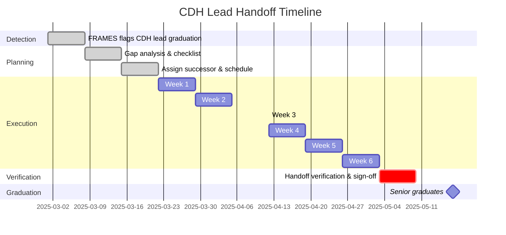

<a href="/Portfolio/bronco-demo/problem/">← 1. The Problem</a> | <strong>2. The Solution</strong> | <a href="/Portfolio/bronco-demo/architecture/">3. Architecture →</a>

---

# The Solution: Predictive Organizational Mapping

FRAMES solves BSL's challenges by **mapping organizational structure** and **predicting vulnerabilities before they cause failures**.

---

## How FRAMES Works

**Core Workflow:**
1. **Map** — Who knows what, how teams connect, where knowledge lives
2. **Measure** — Six diagnostic dimensions assess interface health
3. **Predict** — Identify which connections will fail under stress
4. **Intervene** — Design targeted interventions before problems occur
5. **Improve** — Measure outcomes, refine predictions, iterate

---

## Four Core Capabilities

### 1. Predictive Risk Assessment

**What It Does:**
Identifies vulnerabilities 3-6 months before they cause mission failures.

**How It Works:**
Maps team structure and scores interfaces using six diagnostic dimensions:
- Actor Autonomy (conflicting objectives?)
- Partitioned Knowledge (siloed expertise?)
- Emergent Outputs (shifting requirements?)
- Temporal Misalignment (schedule conflicts?)
- Integration Cost (sustainable coordination?)
- Coupling Degradation (planned connections still occurring?)

**For BSL, This Means:**

| Risk Type | What FRAMES Detects | Intervention Opportunity |
|-----------|---------------------|--------------------------|
| **Knowledge Concentration** | Sarah is the only person who understands power budget | Document before she graduates; cross-train junior member |
| **Interface Degradation** | ADCS ↔ CDH meetings dropped from weekly to monthly | Reinstate coordination; flag for leadership attention |
| **Transition Risk** | 3 subsystem leads graduating same semester with no handoff plan | Create structured handoffs starting 6 weeks before graduation |
| **External Misalignment** | NASA requirements changed but didn't reach implementation teams | Strengthen requirements flow; add verification step |

---

### 2. Adaptive Onboarding System

**The Problem:**
New BSL members take 2-3 months to become productive because they're learning:
- Foundational skills (varies by background)
- Project-specific context (mission goals, design decisions)
- Subsystem technical details
- Team workflows and tools

Team leads repeat the same training every semester.

**The FRAMES Solution:**

**Student LMS (Learning Management System):**
- **Personalized learning paths** based on prior experience
- **Scaffolded content** from foundations to advanced topics
- **Competency validation** before advancing
- **Just-in-time hints** when stuck
- **Progress dashboard** showing completion and gaps

**Impact:**
- **Onboarding time:** 2-3 months → 3-4 weeks (60% reduction)
- **Team lead training hours:** 10 hrs/week → 3 hrs/week (70% reduction)
- **Consistency:** Every member gets same quality training
- **Team lead focus:** Context and project-specific knowledge, not foundational repetition

---

### 3. AI-Assisted Knowledge Capture

**The Problem:**
Documentation always falls behind because team leads are overwhelmed.

**The FRAMES Approach:**

Three-level AI agent architecture with **mandatory human oversight**:

| Agent Level | Role | Autonomy | Example |
|-------------|------|----------|---------|
| **Alpha** | Observation | None | Read GitHub commits, detect patterns, generate reports |
| **Beta** | Drafting | Low | Propose documentation, flag risks (human reviews) |
| **Gamma** | Execution | Medium | Update records with approval, trigger notifications |

**Workflow:**
1. **Alpha Agent** reads team activities (meeting notes, GitHub commits, design reviews)
2. **Beta Agent** drafts documentation (SOPs, decision records, handoff guides)
3. **Human Reviews** and approves/rejects
4. **Gamma Agent** executes approved changes (audit logged)

**Example Scenario:**
- Meeting notes mention new power budget procedure
- Alpha agent identifies this as undocumented process
- Beta agent drafts SOP based on meeting discussion
- Team lead reviews, edits, approves
- Gamma agent adds to knowledge base
- New members see it in onboarding module automatically

**Nothing changes without human approval.**

---

### 4. Handoff Management

**The Problem:**
Handoffs happen in the last week before graduation (if at all).

**The FRAMES Solution:**

**Automated Handoff System:**
- **Early Detection:** Flags upcoming departures 8 weeks in advance
- **Gap Analysis:** Identifies what knowledge is held only by departing members
- **Checklist Generation:** Creates subsystem-specific handoff tasks
- **Verification:** Confirms incoming members actually understand critical knowledge
- **Overlap Planning:** Schedules knowledge transfer sessions during overlap period

**Example BSL Handoff Plan:**

**Impact:**
- No surprise departures
- Verified knowledge transfer (not just "we talked about it")
- Successor confidence and competence
- Reduced mission risk from personnel changes

---

## Value Proposition for BSL

### Before FRAMES

| Metric | Status |
|--------|--------|
| **Onboarding Time** | 2-3 months |
| **Knowledge Retention** | ~70% each rotation |
| **Team Lead Training Burden** | 10+ hrs/week |
| **Risk Visibility** | Reactive (problems found at integration) |
| **Mission Success Probability** | Unknown |
| **Interface Health** | Invisible until failure |

### With FRAMES

| Metric | Status | Improvement |
|--------|--------|-------------|
| **Onboarding Time** | 3-4 weeks | 60% reduction |
| **Knowledge Retention** | ~90% each rotation | Structural handoffs prevent loss |
| **Team Lead Training Burden** | 3 hrs/week | 70% reduction |
| **Risk Visibility** | Proactive (3-6 month lead time) | Early intervention capability |
| **Mission Success Probability** | Quantified + trending | Data-driven decisions |
| **Interface Health** | Dashboard with alerts | Degradation visible before failure |

---

## What Makes FRAMES Different

| Traditional Approach | FRAMES Approach |
|---------------------|-----------------|
| Track tasks | Track people and knowledge |
| Reactive problem solving | Predictive risk assessment |
| Generic training | Personalized learning paths |
| Hope documentation happens | Extract knowledge from activities |
| Last-minute handoffs | Structured 6-week transitions |
| Gut feeling about risks | Quantified probability scores |

---

## Real-World Application: The CDH Scenario (Revisited)

**Same Scenario, FRAMES Deployed:**

**March 2024:**
- FRAMES flags CDH lead as high-risk departure (single point of failure)
- Generates knowledge concentration alert to lab director
- Proposes 6-week handoff plan starting April 1

**April 2024:**
- Automated checklist: architecture docs, interface specs, design rationale
- Alpha agent extracts procedures from CDH lead's commits and notes
- Beta agent drafts technical documentation for review
- Successor assigned, overlap planned

**May 2024:**
- Week-by-week structured handoff (see Gantt chart above)
- LMS provides supplementary learning modules for successor
- Verification quiz confirms understanding of critical concepts
- Sign-off before graduation

**Fall 2024:**
- New CDH leads confident and prepared
- Design review happens on schedule
- Integration smooth because interfaces were maintained
- NASA stakeholders impressed with continuity

**Outcome:**
- Zero schedule slip
- No rework
- Higher team morale (less crisis management)
- Validated mission success prediction increased from 60% → 85%

---

## Implementation Summary

**Phase 1: Foundation (Months 1-3)**
- Integrate BSL Notion workspace and GitHub
- Map current team structure
- Deploy Student LMS with pilot cohort
- Generate first risk assessment

**Phase 2: Expansion (Months 4-6)**
- Beta agent with human review workflow
- Team dashboard with risk visualization
- Spring 2025 handoffs managed by system

**Phase 3: Validation (Months 7-12)**
- Full academic year data collection
- Predictive model validation
- Research paper submission

**Investment:** ~$50K Phase 1, ROI in 12-18 months

---

<h3 style="margin-top: 0; color: white;">Ready to See How It's Built?</h3>

The next section covers the technical architecture—six layers from observations to predictions.

---

<a href="/Portfolio/bronco-demo/problem/">← Previous: The Problem</a> | <a href="/Portfolio/bronco-demo/architecture/" style="font-weight: bold;">Next: Architecture →</a>

