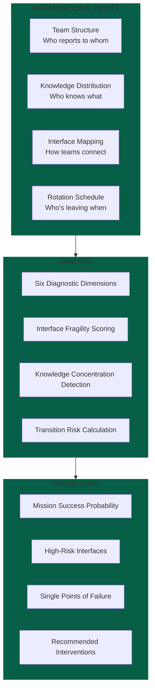
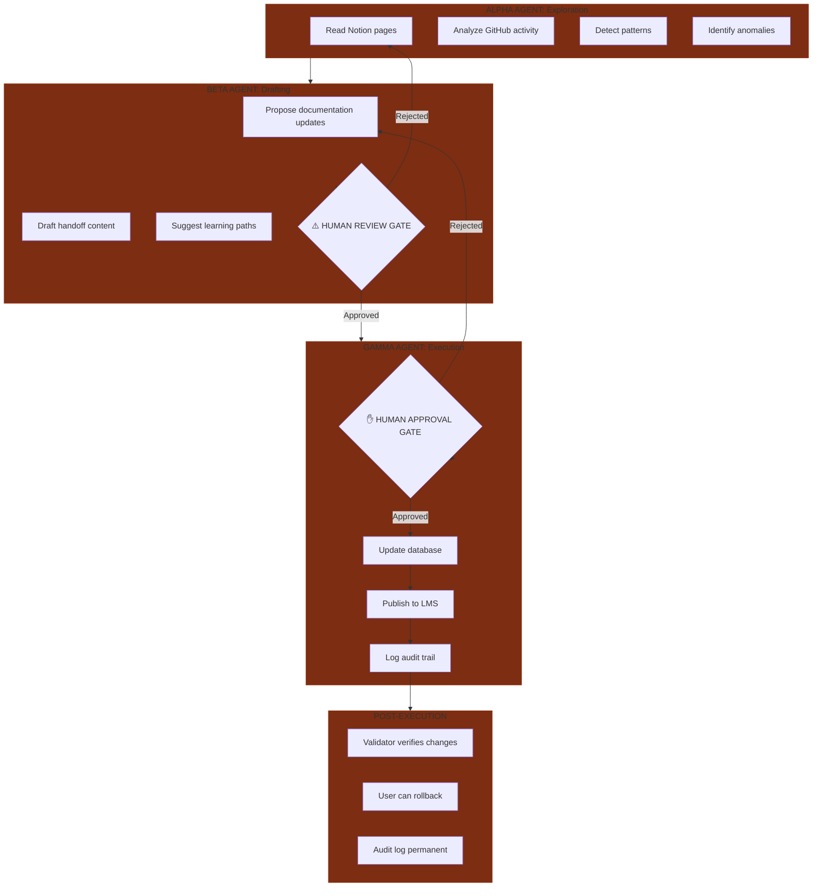

# FRAMES Implementation at Bronco Space Lab
## Internal Stakeholder Briefing

**Purpose:** This document provides Bronco Space Lab leadership with technical details, implementation status, and resource requirements for the FRAMES platform deployment.

**Audience:** Lab Director, Program Managers, Technical Leads

**Date:** December 2024

---

## Executive Summary

FRAMES addresses a critical challenge facing Bronco Space Lab: **predicting and preventing mission failures caused by student rotation and knowledge loss**. This platform instruments team structure, identifies vulnerabilities before they cause problems, and provides adaptive onboarding for new team members.

**Current Status:** Research phase with functional prototype components
**Next Phase:** Lab-specific deployment and validation
**Investment Required:** Technical infrastructure, data integration, validation studies

---

## The Problem FRAMES Solves

Bronco Space Lab faces structural challenges inherent to university space programs:

| Challenge | Impact | Current Mitigation | FRAMES Solution |
|-----------|--------|-------------------|-----------------|
| **Student Rotation** | Knowledge loss every semester | Manual documentation, overlap periods | Automated knowledge mapping, adaptive handoffs |
| **Knowledge Silos** | Critical expertise in single individuals | Hope they document before leaving | Identify concentration risks proactively |
| **Onboarding Time** | 2-3 months before productivity | Team lead personal training | Adaptive learning paths, reduced to weeks |
| **Interface Failures** | Subsystems don't integrate | Last-minute firefighting | Predict coordination breakdowns early |
| **Mission Risk** | Unknown failure probability | Post-mortem after issues occur | Predictive risk scoring before problems |

---

## System Architecture

FRAMES uses a six-layer architecture to observe, interpret, and act on organizational structure:

```mermaid
flowchart TB
    subgraph RW["1. REAL WORLD LAYER"]
        A[Bronco Space Lab activities<br/>Design reviews · Code commits · Team meetings]
    end

    subgraph DO["2. DIGITAL OBSERVATION LAYER"]
        B1[Notion workspace]
        B2[GitHub repositories]
        B3[Manual assessments]
    end

    subgraph INT["3. INTERPRETATION / AGENT LAYER"]
        C1[Alpha Agent: Read & Analyze]
        C2[Beta Agent: Draft Suggestions]
        C3[Gamma Agent: Execute with Approval]
    end

    subgraph CAN["4. CANONICAL DATA LAYER"]
        D[Neon PostgreSQL Database<br/>37+ Tables · Team structure · Knowledge maps]
    end

    subgraph APP["5. APPLICATION LAYER"]
        E1[Student LMS<br/>Onboarding · Training]
        E2[Team Tools<br/>Handoff management]
        E3[Analytics Dashboard<br/>Risk prediction]
    end

    subgraph GOV["6. GOVERNANCE LAYER"]
        F[Audit logs · FERPA compliance · Access control]
    end

    RW --> DO
    DO --> INT
    INT --> CAN
    CAN --> APP
    APP --> GOV

    style RW fill:#2d3748,stroke:#4a5568
    style DO fill:#2d3748,stroke:#4a5568
    style INT fill:#2d3748,stroke:#4a5568
    style CAN fill:#2d3748,stroke:#4a5568
    style APP fill:#2d3748,stroke:#4a5568
    style GOV fill:#2d3748,stroke:#4a5568
```

---

## Data Flow: From Activities to Predictions

```mermaid
flowchart LR
    subgraph INPUT["DATA SOURCES"]
        I1[Notion Pages<br/>Documentation · Decisions]
        I2[GitHub Activity<br/>Commits · PRs · Issues]
        I3[Direct Entry<br/>Assessments · Surveys]
    end

    subgraph PROCESS["PROCESSING"]
        P1[MCP Servers<br/>Secure API access]
        P2[AI Agents<br/>Pattern detection]
        P3[Validation<br/>Human review]
    end

    subgraph STORE["STORAGE"]
        S1[(PostgreSQL<br/>Team structure<br/>Knowledge maps<br/>Risk scores)]
    end

    subgraph OUTPUT["OUTPUTS"]
        O1[Student LMS<br/>Personalized learning]
        O2[Team Dashboard<br/>Risk alerts]
        O3[Analytics<br/>Research data]
    end

    I1 --> P1
    I2 --> P1
    I3 --> P1
    P1 --> P2
    P2 --> P3
    P3 --> S1
    S1 --> O1
    S1 --> O2
    S1 --> O3

    style INPUT fill:#1a365d,stroke:#2c5282
    style PROCESS fill:#1a365d,stroke:#2c5282
    style STORE fill:#1a365d,stroke:#2c5282
    style OUTPUT fill:#1a365d,stroke:#2c5282
```

---

## Predictive Model Framework

### Inputs → Processing → Outputs

### Six Diagnostic Dimensions (NDA Framework)

The model assesses each team interface using:

1. **Actor Autonomy** — Do subsystems have conflicting objectives?
2. **Partitioned Knowledge** — Is critical knowledge siloed?
3. **Emergent Outputs** — How often do requirements change mid-development?
4. **Temporal Misalignment** — Do academic calendars conflict with project timelines?
5. **Integration Cost** — Is coordination effort sustainable?
6. **Coupling Degradation** — Are planned interfaces still occurring?

Each dimension scored 0-10; interfaces scoring >7 flagged as high-risk.

---

## AI Agent Workflow (with Human Oversight)

FRAMES uses three agent types that **learn and collaborate autonomously**, with human approval required before publication:

**Key Safety Features:**
- No autonomous database writes
- All suggestions reviewed by humans
- Complete audit trail
- Rollback capability
- Circuit breakers for runaway operations

---

## Implementation Status

### What's Built (Functional Prototype)

| Component | Status | Evidence |
|-----------|--------|----------|
| **Database Schema** | ✅ Complete | 37 tables, normalized design, migration scripts |
| **MCP Server Integration** | ✅ Functional | Notion + GitHub read access working |
| **Alpha Agent (Read-Only)** | ✅ Deployed | Pattern detection operational |
| **Student LMS Frontend** | ✅ Prototype | React PWA with core features |
| **Predictive Model Framework** | ✅ Validated | NDA dimensions defined, scoring algorithm tested |

### What's Planned (Lab Deployment)

| Component | Timeline | Requirements |
|-----------|----------|--------------|
| **Bronco Space Lab Data Integration** | Phase 1 (3 months) | Notion workspace access, GitHub API keys |
| **Beta Agent Deployment** | Phase 1 | Human review workflow, approval UI |
| **Team Dashboard** | Phase 2 (6 months) | Risk visualization, alert system |
| **Gamma Agent (Controlled Actions)** | Phase 2 | Additional safety testing |
| **Research Validation Study** | Phase 3 (12 months) | IRB approval, multi-semester data collection |

---

## Bronco Space Lab Interface Map

Example mapping of actual team structure (to be customized with real data):

```mermaid
flowchart TB
    subgraph EXT["EXTERNAL INTERFACES"]
        NASA[NASA Mission Support]
        Vendors[Component Vendors]
        Faculty[Faculty Advisors]
    end

    subgraph INTERNAL["BRONCO SPACE LAB"]
        subgraph LEAD["LEADERSHIP"]
            Director[Lab Director]
            PM[Program Manager]
        end

        subgraph SUBSYSTEMS["SUBSYSTEM TEAMS"]
            ADCS[ADCS Team<br/>3 students]
            PWR[Power Team<br/>2 students]
            COMM[Comms Team<br/>2 students]
            CDH[CDH Team<br/>3 students]
        end

        subgraph SUPPORT["SUPPORT FUNCTIONS"]
            SYS[Systems Engineering<br/>2 students]
            TEST[Integration & Test<br/>2 students]
        end
    end

    subgraph COHORTS["STUDENT COHORTS"]
        Senior[Graduating Spring 2025]
        Junior[Staying through Fall 2025]
        New[Joining Spring 2025]
    end

    NASA -.->|Requirements| Director
    Director --> PM
    PM --> SUBSYSTEMS
    PM --> SUPPORT

    ADCS <--> CDH
    PWR <--> CDH
    COMM <--> CDH

    SYS --> SUBSYSTEMS
    TEST --> SUBSYSTEMS

    Senior -.->|Leaving Soon| SUBSYSTEMS
    Junior --> SUBSYSTEMS
    New -.->|Onboarding| SUBSYSTEMS

    style EXT fill:#1e3a8a,stroke:#1e40af
    style INTERNAL fill:#064e3b,stroke:#065f46
    style COHORTS fill:#7c2d12,stroke:#9a3412
```

**Risk Flags FRAMES Would Identify:**
- CDH team is critical interface hub (single point of failure)
- Spring 2025 graduating cohort creates knowledge loss event
- New members joining mid-project need accelerated onboarding
- External interfaces (NASA) have different timelines than academic calendar

---

## Value Proposition for Bronco Space Lab

### Problem: Current State Without FRAMES

- **Time to Productivity:** New members take 2-3 months to contribute
- **Knowledge Loss:** ~30% of institutional knowledge lost each graduation
- **Team Lead Burden:** 10+ hours/week on training and coordination
- **Risk Visibility:** Problems discovered during integration, not before
- **Mission Success:** Uncertain; no predictive capability

### Solution: With FRAMES Deployed

| Metric | Current | With FRAMES | Improvement |
|--------|---------|-------------|-------------|
| **Onboarding Time** | 2-3 months | 3-4 weeks | 60% reduction |
| **Knowledge Retention** | ~70% | ~90% | Structural handoffs |
| **Team Lead Training Hours** | 10 hrs/week | 3 hrs/week | 70% reduction |
| **Risk Detection** | Reactive | Proactive | 3-6 month lead time |
| **Mission Success Probability** | Unknown | Quantified + improving | Data-driven decisions |

### Financial Impact (Estimated)

- **Cost Savings:** Reduced rework from integration failures: $15K-30K/year
- **Efficiency Gains:** Team lead time freed for technical work: 280 hrs/year
- **Risk Mitigation:** Early detection prevents mission delays (priceless)
- **Investment Required:** Infrastructure + validation: $50K Phase 1

**ROI Timeline:** 12-18 months to positive ROI through efficiency gains

---

## Implementation Roadmap

### Phase 1: Foundation (Months 1-3)

**Deliverables:**
- Bronco Space Lab data integration (Notion + GitHub)
- Current team structure mapped in database
- Student LMS deployed with pilot cohort
- Alpha agent monitoring team activities
- First risk assessment report generated

**Resources Required:**
- API access to Notion workspace + GitHub org
- 1 grad student (20 hrs/week) for data validation
- PostgreSQL hosting ($20/month Neon serverless)
- OpenAI API credits ($100/month estimated)

### Phase 2: Expansion (Months 4-6)

**Deliverables:**
- Beta agent deployed with human review workflow
- Team dashboard with risk visualization
- Automated handoff management for Spring 2025 rotation
- Onboarding system validated with new cohort
- Semester 1 data collected for research validation

**Resources Required:**
- Front-end developer (15 hrs/week) for dashboard
- Faculty advisor review time (2 hrs/week)
- Expanded API usage ($200/month)

### Phase 3: Validation (Months 7-12)

**Deliverables:**
- Full academic year data collection
- Predictive model validation (did predictions match outcomes?)
- Research paper submission
- Gamma agent pilot (controlled actions)
- Multi-university expansion planning

**Resources Required:**
- IRB approval for research study
- Data analysis support (grad student + faculty)
- Conference travel for results presentation

---

## Risk Assessment & Mitigation

| Risk | Likelihood | Impact | Mitigation |
|------|------------|--------|------------|
| **Data Privacy Violations** | Low | Critical | FERPA compliance built-in, audit trails, access control |
| **AI Agent Errors** | Medium | High | Human approval gates, rollback capability, limited scope |
| **Student Resistance** | Low | Medium | Voluntary participation, clear value proposition, UX focus |
| **Technical Complexity** | Medium | Medium | Incremental deployment, prototype validation, documentation |
| **Resource Constraints** | Medium | High | Phased approach, external funding pursuit (NASA STRI grants) |
| **Faculty Time Burden** | High | Medium | Automation reduces long-term burden, upfront investment required |

**Circuit Breakers:**
- Pause deployment if error rate >5%
- Rollback capability for all database changes
- Manual override for all agent actions
- Regular security audits

---

## Success Metrics

### Operational Metrics (Tracked in System)

- Time to productivity for new members
- Knowledge retention across rotations
- Team lead hours spent on training
- Interface health scores over time
- Prediction accuracy vs. actual outcomes

### Research Metrics (Academic Validation)

- Correlation between structural metrics and mission outcomes
- Predictive model accuracy (ROC curves, precision/recall)
- Comparison with traditional project management approaches
- Generalizability to other university programs

### Qualitative Feedback

- Student satisfaction with onboarding
- Team lead perception of tool utility
- Lab director confidence in risk visibility
- NASA stakeholder feedback on team performance

---

## Technology Stack Summary

| Layer | Technology | Maturity |
|-------|------------|----------|
| **Frontend** | React 18, TypeScript, PWA | Production-ready |
| **Backend** | Flask 3.0, Python 3.9+ | Production-ready |
| **Database** | Neon PostgreSQL 15+ | Cloud-hosted, scalable |
| **AI/ML** | LangChain, LangGraph, GPT-4 | Established frameworks |
| **Infrastructure** | Docker, GitHub Actions | Standard DevOps |
| **Research** | Jupyter, MLflow, Superset | Academic standard |

**Security:**
- Role-based access control (RBAC)
- API key management
- Encrypted data at rest and in transit
- Regular dependency updates

---

## Funding & Sustainability

### Current Funding Status
- **Cal Poly Pomona:** Internal research funding (PI: Elizabeth Osborn)
- **Partner Institutions:** In-kind contributions (8 universities)

### Future Funding Opportunities
- **NASA STRI Grant:** Space Technology Research Institutes (~$15M over 5 years)
- **NSF EEC:** Engineering Education & Centers (~$500K-2M)
- **Industry Partnerships:** Commercial space companies, defense contractors

### Long-Term Sustainability Model
- Open-source core platform (community maintenance)
- Commercial licensing for corporate deployments
- Consulting services for implementation
- Subscription model for cloud-hosted instances

---

## Next Steps for Lab Director Approval

1. **Review this briefing** and identify concerns/questions
2. **Technical demo** — Schedule 1-hour walkthrough of prototype
3. **Data access approval** — Authorize Notion + GitHub API integration
4. **Student consent** — IRB protocol for research participation
5. **Resource commitment** — Approve Phase 1 timeline and budget
6. **Pilot launch** — Deploy with Spring 2025 cohort

---

## Questions & Answers

### "How is this different from project management software?"

Traditional PM tools (Jira, Asana) track tasks—FRAMES maps **people, knowledge, and relationships**. It predicts **who leaving will break what**, not just which tasks are overdue.

### "What if students don't use it?"

The LMS provides direct value (personalized onboarding), making adoption natural. Analytics layer runs passively—students don't need to change behavior for risk prediction to work.

### "What about data privacy?"

FERPA-compliant from the ground up. Students consent to research participation. No data shared outside institution without IRB approval. Audit trails on all access.

### "How do we know the predictions are accurate?"

Phase 3 validation compares structural metrics at semester start against mission outcomes at semester end. Multiple semesters of data build confidence. Baseline: better than current "gut feeling" approach.

### "What if AI makes a mistake?"

Agents can learn and analyze autonomously, but can't write to databases or publish without human approval. Complete audit trail allows rollback. Incremental deployment catches issues early.

### "Can other labs use this?"

Yes—that's the research contribution. The framework generalizes to any complex engineering team with rotating personnel. Bronco Space Lab becomes the validation case study.

---

## Contact & Documentation

**Project Lead:**
Elizabeth Osborn | Cal Poly Pomona
[eosborn@cpp.edu](mailto:eosborn@cpp.edu)

**Technical Repository:**
[github.com/Lizo-RoadTown/FRAMES-Python](https://github.com/Lizo-RoadTown/FRAMES-Python)

**Public Portfolio:**
[lizo-roadtown.github.io/Portfolio](https://lizo-roadtown.github.io/Portfolio)

**Additional Documentation:**
- Database schema & API documentation (GitHub wiki)
- LangGraph workflow specifications
- MCP server integration guide
- Student LMS user manual

---

## Approval Signature

**Lab Director:** _______________________ **Date:** _______

**Notes/Conditions:**

---

*This briefing is internal documentation for Bronco Space Lab stakeholders. For external communications, see public portfolio at [lizo-roadtown.github.io/Portfolio](https://lizo-roadtown.github.io/Portfolio).*
