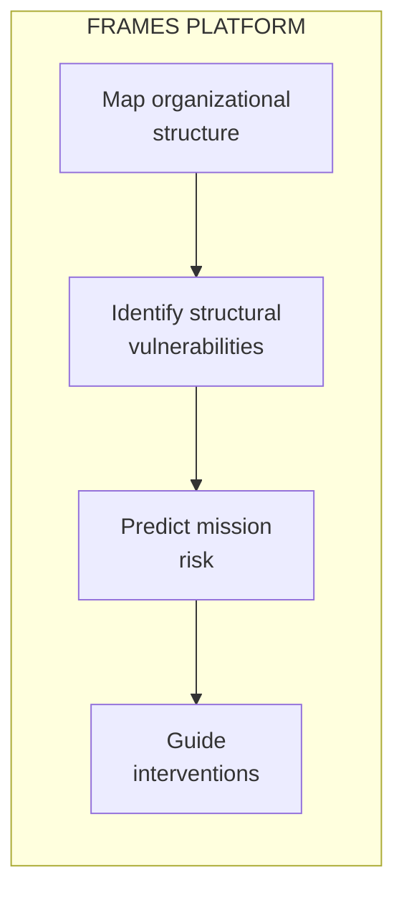

# Framework for Research & Analytics in Mission Engineering Systems

**FRAMES** is a multi-university research platform developing **predictive models for organizational mission success** in complex engineering environments.

---

## The Research Question

> **Can we predict mission success or failure based on organizational structure?**

University space programs train the next generation of aerospace engineers while delivering real NASA-contracted missions. Yet structural challenges—student rotation, knowledge handoffs, team interface maintenance—limit documented success rates to 12-15%.

These programs provide an ideal research environment: real stakes, fully observable structure, clear success metrics. Insights developed here apply directly to NASA centers, commercial space companies, startups, and R&D organizations facing similar knowledge continuity challenges.

---

## What FRAMES Does

| Capability | Description |
|------------|-------------|
| **Organizational Mapping** | Instrument team structure—interfaces, bond strength, knowledge distribution |
| **Risk Prediction** | Identify vulnerabilities before they cause failure |
| **Knowledge Continuity** | Track where expertise lives and what breaks when people leave |
| **Intervention Design** | Evidence-based recommendations for reinforcing weak interfaces |

---

## Who Uses FRAMES

<h3>Researchers</h3>

<em>If you study organizational resilience, engineering education, or sociotechnical systems:</em>

Instrumented engineering teams, validated predictive models, natural experiments in knowledge transfer.

<a href="/Portfolio/researchers/">Learn more →</a>

<h3>Program Administrators</h3>

<em>If you run university labs, space programs, or complex engineering teams:</em>

Identify vulnerabilities before they cause failure, predict knowledge crises, design evidence-based interventions.

<a href="/Portfolio/administrators/">Learn more →</a>

<h3>Technical Leads</h3>

<em>If you want to integrate, extend, or understand the implementation:</em>

Six-layer architecture, AI agent workflows, PostgreSQL schema, API documentation.

<a href="/Portfolio/technical/">Learn more →</a>

---

## What the Model Predicts

| Risk Factor | Prediction |
|-------------|------------|
| **Interface fragility** | Which connections between subsystems will fail under stress |
| **Knowledge concentration** | Single points of failure where expertise is too centralized |
| **Transition risk** | What breaks when key people leave |
| **Subsystem isolation** | Which teams aren't communicating enough |
| **Mission success probability** | Overall likelihood given current structure |

[Learn more about the Predictive Model →](/Portfolio/predictive-model/)

---

## Key Features

<h3>Predictive Model</h3>

Uses Herbert Simon's research on complex systems to predict mission success based on organizational structure.

<a href="/Portfolio/predictive-model/">Learn more →</a>

<h3>AI Agents</h3>

Extract knowledge from team activities and draft documentation—with human oversight at every step.

<a href="/Portfolio/agents/">Learn more →</a>

<h3>Onboarding & Learning</h3>

Adaptive learning paths that reduce time-to-productivity for new team members.

<a href="/Portfolio/onboarding/">Learn more →</a>

<h3>Team Lead Tools</h3>

Reduce burden on team leads with automated handoff management and documentation support.

<a href="/Portfolio/team-tools/">Learn more →</a>

---

## Why University Space Labs?

University CubeSat programs are the ideal research environment:

- **Real stakes** — NASA-contracted missions with actual deliverables
- **Observable structure** — Teams small enough to fully instrument
- **Clear outcomes** — Missions succeed or fail; no ambiguity  
- **Natural experiments** — Student rotation creates controlled knowledge loss events

The insights developed here apply directly to NASA centers, commercial space companies, R&D labs, and any organization undertaking complex emergent technology missions.

---

## Partner Institutions

FRAMES spans **8 universities**:

Cal Poly Pomona (Lead) · Columbia University · Texas State University · Virginia Tech · Washington State University · University of Illinois · Northeastern University · Mt. San Antonio College

---

## Contact

**Elizabeth Osborn** | Cal Poly Pomona
[eosborn@cpp.edu](mailto:eosborn@cpp.edu)
Available for research collaboration, consulting, and graduate program inquiries.

[View GitHub Repository →](https://github.com/Lizo-RoadTown/Portfolio)

