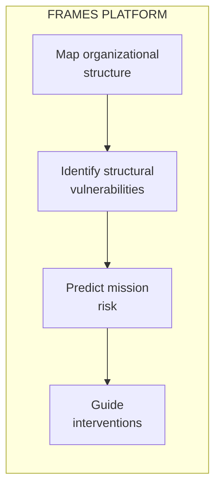

# Framework for Research & Analytics in Mission Engineering Systems

**FRAMES** is a multi-university research platform developing **predictive models for organizational mission success** in complex engineering environments.

---

## The Research Question

> **Can we predict mission success or failure based on organizational structure?**

88% of university CubeSat programs fail to persist long enough to achieve mission success. These failures are not technical—they are structural. Critical knowledge concentrates in too few people, interfaces between teams degrade, and expertise walks out the door when students graduate.

FRAMES is building a diagnostic framework, grounded in Herbert Simon's work on complex systems, that identifies these structural vulnerabilities before they cause mission failure.

---

## What FRAMES Does

| Capability | Description |
|------------|-------------|
| **Organizational Mapping** | Instrument team structure—interfaces, bond strength, knowledge distribution |
| **Risk Prediction** | Identify vulnerabilities before they cause failure |
| **Knowledge Continuity** | Track where expertise lives and what breaks when people leave |
| **Intervention Design** | Evidence-based recommendations for reinforcing weak interfaces |

---

## Who Uses FRAMES

<h3>Researchers</h3>

Study organizational resilience using instrumented engineering teams as your research environment.

<a href="/Portfolio/researchers/">Learn more →</a>

<h3>Program Administrators</h3>

Identify and address organizational vulnerabilities before they cause mission failure.

<a href="/Portfolio/administrators/">Learn more →</a>

<h3>Technical Leads</h3>

Understand the architecture, API, and implementation details for integration.

<a href="/Portfolio/technical/">Learn more →</a>

---

## What the Model Predicts

| Risk Factor | Prediction |
|-------------|------------|
| **Interface fragility** | Which connections between subsystems will fail under stress |
| **Knowledge concentration** | Single points of failure where expertise is too centralized |
| **Transition risk** | What breaks when key people leave |
| **Subsystem isolation** | Which teams aren't communicating enough |
| **Mission success probability** | Overall likelihood given current structure |

---

## Why University Space Labs?

University CubeSat programs are the ideal research environment:

- **Real stakes** — NASA-contracted missions with actual deliverables
- **Observable structure** — Teams small enough to fully instrument
- **Clear outcomes** — Missions succeed or fail; no ambiguity  
- **Natural experiments** — Student rotation creates controlled knowledge loss events

The insights developed here apply directly to NASA centers, commercial space companies, R&D labs, and any organization undertaking complex emergent technology missions.

---

## Partner Institutions

FRAMES spans **8 universities**:

Cal Poly Pomona (Lead) · Columbia University · Texas State University · Virginia Tech · Washington State University · University of Illinois · Northeastern University · Mt. San Antonio College

---

## Contact

**Project Lead:** Elizabeth Osborn  
**Email:** [eosborn@cpp.edu](mailto:eosborn@cpp.edu)  
**Institution:** Cal Poly Pomona  
**Repository:** [GitHub](https://github.com/Lizo-RoadTown/Portfolio)

