# What is FRAMES?

**FRAMES** (Framework for Research & Analytics in Mission Engineering Systems) is a **multi-university research platform** developing predictive models for **organizational mission success** in complex engineering environments.

University space labs serve as the research environment—small enough to fully instrument, with clear mission outcomes and natural experiments in knowledge loss as students rotate. The insights apply far beyond education: any organization undertaking complex emergent technology missions faces the same structural risks.

---

## The Research Question

> **Can we predict mission success or failure based on organizational structure?**

FRAMES is building a predictive model grounded in Herbert Simon's work on near-decomposable systems. By mapping interfaces between people and subsystems, measuring bond strength, and tracking knowledge distribution, the model identifies structural vulnerabilities before they cause mission failure.

---

## Key Capabilities

| Capability | Description |
|------------|-------------|
| **Organizational Mapping** | Instrument team structure: interfaces, bond strength, knowledge distribution |
| **Risk Prediction** | Identify structural vulnerabilities before they cause mission failure |
| **Knowledge Continuity** | Track where expertise lives and what breaks when people leave |
| **Mission Success Modeling** | Predictive model trained on real outcomes from complex engineering missions |

---

## Project Scale

| Metric | Value |
|--------|-------|
| **Partner Universities** | 8 institutions |
| **Database Tables** | 37+ structured tables |
| **AI Agents** | 3 specialized agents mapping organizational structure |
| **Predictive Model** | Mission risk prediction based on Simon's molecular model |
| **Research Domains** | 4 theoretical foundations |

**Partnering Universities:** Cal Poly Pomona (Lead), Columbia University, Texas State University, Virginia Tech, Washington State University, University of Illinois, Northeastern University, Mt. San Antonio College

---

## The Real Problem: Team Leads Are Overwhelmed

In university space labs, **team leads carry an impossible burden**:

- **Constant rotation** — Students cycle in and out every semester; team leads start over constantly
- **Onboarding consumes everything** — Hours spent teaching the same basics to each new cohort
- **No time for mentorship** — Administrative burden crowds out hands-on guidance
- **Knowledge walks out the door** — Graduating students take expertise with them
- **Reinventing the wheel** — Each generation rediscovers what predecessors already solved

Team leads want to connect with students, guide projects, and share hard-won expertise. Instead, they're buried in repetitive onboarding, documentation, and process management.

---

## What FRAMES Does for Team Leads

FRAMES exists to **give team leads their time back**:

- **Automated onboarding** — The model handles routine training; team leads handle the human stuff
- **Auto-generated SOPs** — Drop your notes, get lab procedures; no manual documentation grind
- **Smart module recommendations** — Students get the right content at the right time, automatically
- **Knowledge preservation** — Expertise stays in the system when students graduate
- **Workflow automation** — Less administrative overhead, more mentorship time

**The goal:** As the model learns from real outcomes, it gets better at taking documentation burden off team leads—so they can focus on what only humans can do: connect with students and provide hands-on guidance.

---

## The Predictive Model: From Theory to Application

FRAMES is operationalizing Herbert Simon's research on complex organizations into a **predictive model for mission success**.

### The Molecular Model of Organizations

```mermaid
graph LR
    subgraph ORG["🏢 Organizational Structure"]
        A((Person A)) -->|strong| B((Person B))
        B -->|weak| C((Person C))
        A -->|medium| C
        B -->|strong| D((Person D))
    end
```

**Key Concepts:**
- **Nodes** = People holding localized knowledge
- **Bonds** = Interfaces (communication, handoffs, dependencies)  
- **Bond Strength** = Frequency, reciprocity, error recovery
- **Subsystems** = Functional clusters with strong internal bonds

When someone leaves an organization, they don't just remove knowledge—they **break bonds**. The model predicts which bond breaks will cause structural failure.

### What the Model Predicts

| Risk Factor | Prediction |
|-------------|------------|
| **Interface fragility** | Which connections between subsystems will fail under stress |
| **Knowledge concentration** | Single points of failure where expertise is too centralized |
| **Transition risk** | What breaks when key people leave |
| **Subsystem isolation** | Which teams aren't communicating enough |
| **Mission success probability** | Overall likelihood given current structure |

### Why University Space Labs?

These aren't classroom projects—they're NASA-contracted missions with real deliverables:

- **Real contracts** — Actual NASA deliverables with deadlines and consequences
- **Visible interfaces** — Teams small enough to observe every connection
- **Clear outcomes** — Missions succeed or fail; no ambiguity
- **Natural experiments** — Student rotation creates controlled knowledge loss events

The combination of real stakes and observable structure makes university space labs uniquely valuable for organizational research.

### Broader Implications

If the model works here, it applies directly to:

- NASA centers and commercial space programs
- Startup engineering teams
- R&D laboratories
- Any organization undertaking complex emergent technology missions

[Learn more about the architecture →]({{ site.baseurl }}/architecture)

---

## Theoretical Foundations

FRAMES is built on established research:

1. **Nearly Decomposable Architecture** (Herbert Simon) — Models semi-independent organizational modules
2. **Hybrid Autonomous Organizations** (Champenois & Etzkowitz) — University space labs in boundary spaces
3. **OATutor Pedagogy** — Scaffolding, hint pathways, validation steps
4. **Knowledge Transfer Research** — Codified vs tacit knowledge tracking

---

## Contact

**Project Lead:** Elizabeth Osborn  
**Email:** [eosborn@cpp.edu](mailto:eosborn@cpp.edu)  
**Institution:** Cal Poly Pomona  
**Repository:** [GitHub](https://github.com/Lizo-RoadTown/Portfolio)

---

*FRAMES: Predicting mission success through organizational structure analysis.*
