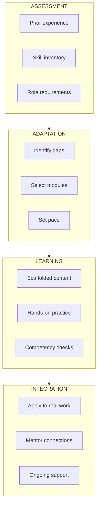
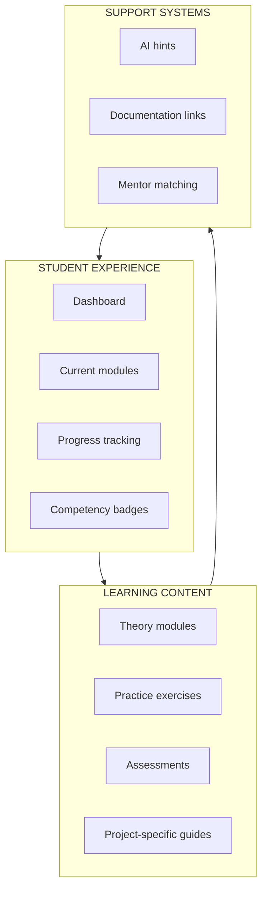

Emergent technology teams face steep learning curves. New members join mid-project, receiving information they can't immediately act on. FRAMES provides structured onboarding support that adapts to individual learners.

---

## The Onboarding Problem

University engineering teams face unique challenges:

| Challenge | Impact |
|-----------|--------|
| **Mid-project entry** | New members join during active development, not at natural starting points |
| **Implicit knowledge** | Procedures exist in senior members' heads, not documentation |
| **Uneven preparation** | Members arrive with different skill levels and backgrounds |
| **Time pressure** | Technical work takes priority; training gets compressed |
| **Rolling cohorts** | The people who should train newcomers are often leaving |

The result: new members take longer to become productive, make preventable mistakes, and add burden to already-overwhelmed team leads.

---

## How FRAMES Helps

### Adaptive Learning Paths

FRAMES assesses each learner's current knowledge and creates personalized pathways:

### Scaffolded Skill Building

Content is structured to build understanding progressively:

1. **Foundational concepts** — Core knowledge everyone needs
2. **Role-specific skills** — What this person needs for their specific work
3. **Project context** — Current mission status, decisions, and rationale
4. **Hands-on application** — Practice with real tools and processes

### Just-in-Time Support

Rather than front-loading all training, FRAMES provides information when learners need it:

- **Hint pathways** — Graduated assistance from gentle nudges to full explanations
- **Contextual help** — Relevant documentation surfaces when working on specific tasks
- **Validation steps** — Catch misunderstandings before they become problems

---

## Student Learning Management System

The Student LMS provides personalized learning experiences:

| Feature | Description |
|---------|-------------|
| **Progress Dashboard** | Visual tracking of completed and upcoming modules |
| **Competency Validation** | Assessments that verify understanding before advancing |
| **Hint System** | Graduated help from subtle hints to full explanations |
| **Role-Based Paths** | Content tailored to specific team roles |

---

## For Team Leads

FRAMES reduces the onboarding burden on team leads:

### Before FRAMES

- Team leads personally train each new member
- Knowledge transfer competes with technical work
- Training quality depends on who's available
- Same questions get answered repeatedly

### With FRAMES

- Structured onboarding handles foundational training
- Team leads focus on project-specific context
- Consistent quality regardless of who's onboarding
- Common questions answered by the system

[Learn more about Team Lead Tools →](/Portfolio/team-tools/)

---

## For Administrators

Track onboarding effectiveness across your program:

| Metric | Insight |
|--------|---------|
| **Time to productivity** | How long before new members contribute meaningfully |
| **Competency gaps** | Where incoming cohorts consistently struggle |
| **Training completion** | Who's finishing required modules |
| **Mentor utilization** | Whether senior members are available for knowledge transfer |

[Learn more about FRAMES for Administrators →](/Portfolio/administrators/)

---

## Content Foundations

FRAMES learning content is built on OATutor pedagogy:

- **Scaffolding** — Break complex skills into manageable steps
- **Hint pathways** — Multiple levels of assistance before showing answers
- **Validation** — Confirm understanding before moving forward
- **Spaced practice** — Reinforce learning over time

This approach has been validated in STEM education contexts and adapted for engineering team onboarding.

---

## Technical Implementation

The Student LMS is built as a **React 18+ Progressive Web App**:

- Works offline for teams with limited connectivity
- Syncs progress when connection is available
- Mobile-friendly for quick reference in labs

For technical details and integration information:

[See Technical Documentation →](/Portfolio/technical/)
