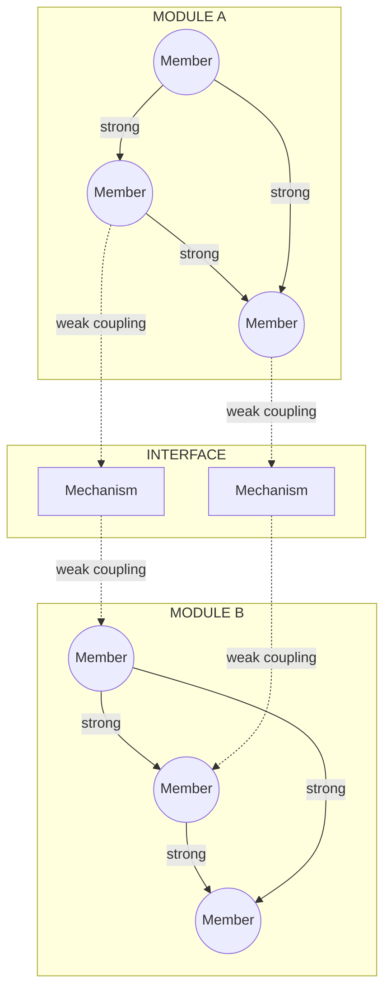
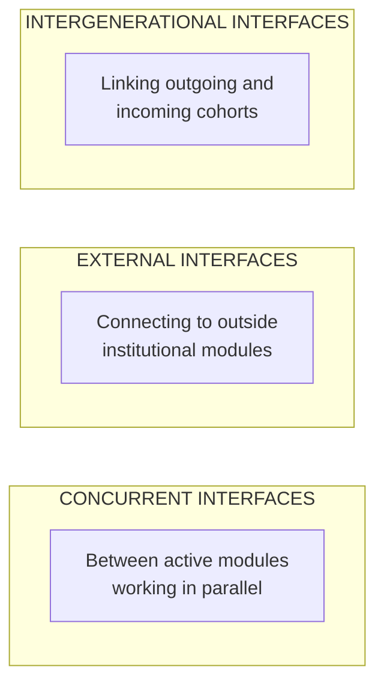
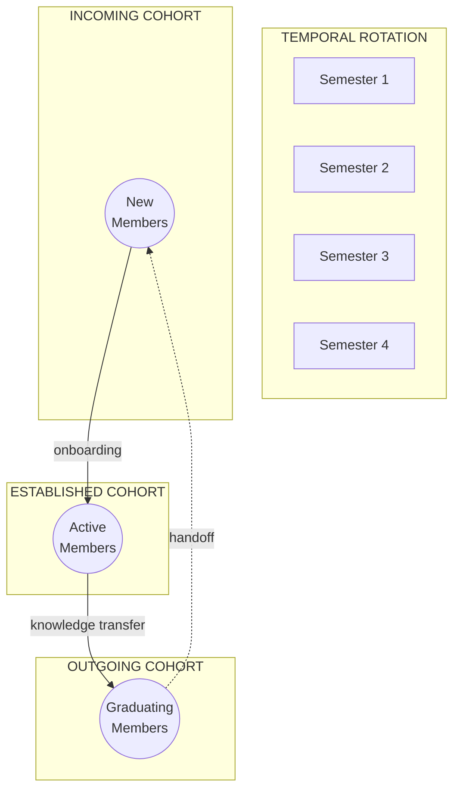

FRAMES uses a diagnostic framework grounded in Herbert Simon's research on complex systems to predict **mission success or failure based on organizational structure**.

---

## The Core Insight

88% of university CubeSat programs fail to persist long enough to achieve mission success. These failures are not technical—they are structural:

- Critical knowledge concentrates in too few people
- Interfaces between teams degrade without maintenance
- Expertise walks out the door when key people leave
- Coordination costs exceed sustainable levels

**If we can measure organizational structure, we can predict where it will fail.**

---

## Theoretical Foundation: Nearly Decomposable Architecture

FRAMES operationalizes Herbert Simon's (1962) research on complex systems using a molecular analogy:

- **Modules** act like cells—performing most work internally with strong internal bonds
- **Interfaces** are the connection points where modules exchange information
- **Couplings** describe bond strength—strong within modules, weaker across external interfaces
- **Interface Mechanisms** are the roles, processes, and tools that maintain connections

This separation allows modules to adapt internally without destabilizing the whole system. But Simon noted that **weaker external bonds can erode if not reinforced**, leading to fragmentation.

---

## What the Model Predicts

| Risk Factor | What It Reveals |
|-------------|-----------------|
| **Interface fragility** | Which connections between subsystems will fail under stress |
| **Knowledge concentration** | Single points of failure where expertise is too centralized |
| **Transition risk** | What breaks when key people leave |
| **Subsystem isolation** | Which teams aren't communicating enough |
| **Mission success probability** | Overall likelihood given current structure |

---

## Interface Categories

The research identifies three categories of interfaces, each with different risk profiles:

| Interface Type | Risk Pattern |
|----------------|--------------|
| **Concurrent** | Coordination failures between parallel teams |
| **External** | Dependency on outside support that may not understand internal needs |
| **Intergenerational** | Knowledge loss during cohort handoffs—the most fragile |

---

## Six Diagnostic Dimensions

FRAMES assesses interfaces using six NDA diagnostic dimensions:

| Dimension | Question |
|-----------|----------|
| **Actor Autonomy** | How independently do interdependent actors operate? Are objectives conflicting? |
| **Partitioned Knowledge** | Is knowledge siloed? What integration mechanisms exist? |
| **Emergent Outputs** | How often do goals shift or remain undefined during development? |
| **Temporal Misalignment** | Do timelines differ across modules (academic calendars vs. project cycles)? |
| **Integration Cost** | Is coordination effort sustainable at each interface? |
| **Coupling Degradation** | Are planned interfaces still occurring? Are modules disengaging? |

---

## Knowledge Types

Two primary knowledge-transfer types exist at interfaces, each with different fragility patterns:

| Knowledge Type | Description | Transfer Mechanism | Fragility |
|----------------|-------------|-------------------|-----------|
| **Codified** | Documented, transferable independent of individuals | Walkthroughs, documentation, design reviews | More resilient |
| **Institutional** | Tacit, experience-based, held by individuals | Mentorship, overlap periods, repetition | Prone to degradation |

Interfaces dominated by institutional knowledge are more prone to degradation when personnel rotate out.

---

## Rotational Micro-Modules

In university space labs, the boundary module is internally composed of overlapping, rotational **micro-modules**—student cohorts that cycle in and out over time (typically 1-4 semesters).

This creates **predictable knowledge-transfer vulnerabilities**:

- Incoming cohorts join mid-project, receiving information they cannot immediately act on
- Middle cohorts pass along knowledge tied only to their current project phase
- Outgoing cohorts graduate before projects complete, leaving incomplete work and undocumented context

---

## Use Cases

### For Administrators

- Identify which team members are single points of failure **before** they leave
- See which interfaces between teams are degrading
- Predict where the next knowledge crisis will occur
- Design interventions based on structural evidence

[Learn more about FRAMES for Administrators →](/Portfolio/administrators/)

### For Researchers

- Test hypotheses about organizational resilience
- Access instrumented teams as natural experiments
- Study how interface strength correlates with mission outcomes
- Build and validate predictive models

[Learn more about FRAMES for Researchers →](/Portfolio/researchers/)

---

## Broader Implications

If the model works in university space labs, it applies directly to:

- NASA centers and commercial space programs
- Startup engineering teams
- R&D laboratories
- Any organization undertaking complex emergent technology missions

---

## References

- Simon, H. A. (1962). The Architecture of Complexity. *Proceedings of the American Philosophical Society*, 106(6), 467-82.
- Champenois, C., & Etzkowitz, H. (2018). From Boundary Line to Boundary Space. *Technovation*, 76-77, 28-39.
- Pham, M., et al. (2024). The Any% Method. *AIAA/USU Conference on Small Satellites*.
