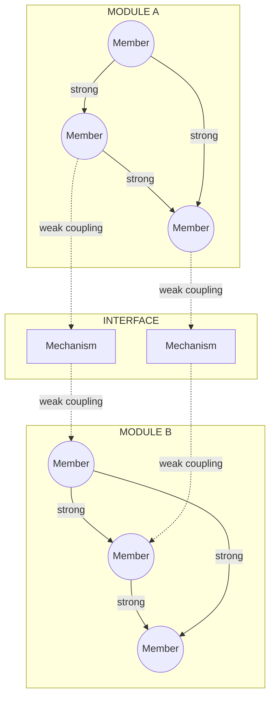
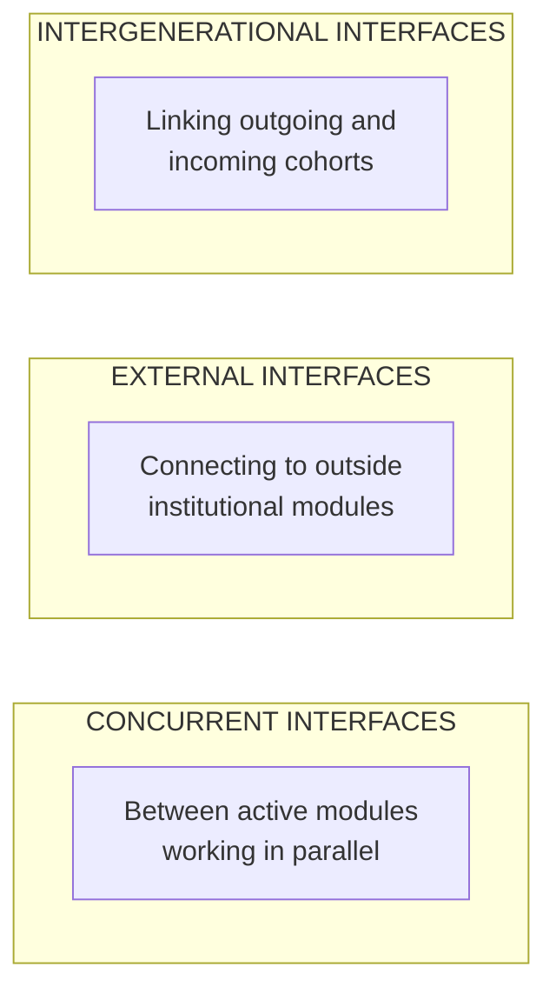
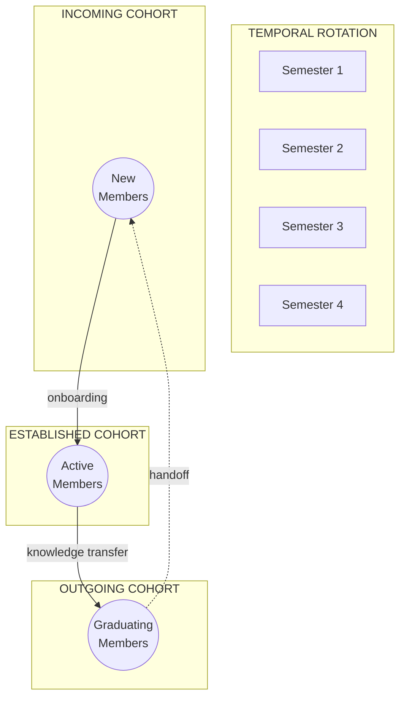

FRAMES provides a research platform for studying **organizational resilience in complex engineering environments**. This page describes the theoretical framework, methodology, and research capabilities.

<strong>Quick Links:</strong> 
<a href="/Portfolio/predictive-model/">The Predictive Model</a> · 
<a href="/Portfolio/agents/">AI Agents</a> · 
<a href="/Portfolio/technical/">Technical Architecture</a>

---

## The Research Question

> **Can we predict mission success or failure based on organizational structure?**

University CubeSat programs provide the ideal research environment: 88% fail to persist long enough to achieve mission success (Pham, 2024). These failures are not a reflection of student capability—they result from programs operating in boundary spaces where institutional classifications, funding categories, and embedded support are unclear or absent.

---

## Theoretical Framework

### Nearly Decomposable Architecture (NDA)

FRAMES operationalizes Herbert Simon's (1962) research on complex systems using a molecular analogy:

- **Modules** act like cells or molecular groups—performing most work internally with strong internal bonds
- **Interfaces** are the connection points where modules exchange information, resources, or coordinate actions
- **Couplings** describe bond strength—strong within modules, weaker across external interfaces
- **Interface Mechanisms** are the roles, processes, and tools that maintain connections and prevent degradation

This separation allows modules to adapt internally without destabilizing the whole system. But Simon noted that **weaker external bonds can erode if not reinforced**, leading to fragmentation.

### Hybrid Autonomous Organizations (HAOs)

Student-led space labs exemplify HAOs (Champenois & Etzkowitz, 2018). Operating outside traditional academic hierarchies, they integrate functions typically distributed across universities, government agencies, and industry: acquiring external funding, managing partnerships, and coordinating complex technical projects.

Their lack of formal classification makes them vulnerable—they must constantly navigate misaligned institutional logics and maintain tenuous connections to surrounding institutions.

---

## Six Diagnostic Dimensions

FRAMES assesses interfaces using six NDA diagnostic dimensions:

| Dimension | Research Question |
|-----------|-------------------|
| **Actor Autonomy** | How independently do interdependent actors operate? Are objectives conflicting? |
| **Partitioned Knowledge** | Is knowledge siloed? What integration mechanisms exist? |
| **Emergent Outputs** | How often do goals shift or remain undefined during development? |
| **Temporal Misalignment** | Do timelines differ across modules (academic calendars vs. project cycles)? |
| **Integration Cost** | Is coordination effort sustainable at each interface? |
| **Coupling Degradation** | Are planned interfaces still occurring? Are modules disengaging? |

---

## Interface Categories

The research identifies three categories of interfaces:

---

## Knowledge Types at Interfaces

Two primary knowledge-transfer types exist at interfaces, each with different fragility patterns:

| Knowledge Type | Description | Transfer Mechanism | Fragility |
|----------------|-------------|-------------------|-----------|
| **Codified** | Documented, transferable independent of individuals | Walkthroughs, documentation repositories, design reviews | More resilient |
| **Institutional** | Tacit, experience-based, held by individuals | In-person experience, repetition, mentorship | Prone to degradation |

Interfaces dominated by institutional knowledge are more prone to degradation when personnel rotate out.

---

## Rotational Micro-Modules

In university space labs, the boundary module is internally composed of overlapping, rotational **micro-modules**—student cohorts, sub-teams, and project groups that cycle in and out over time (typically 1-4 semesters).

This creates **predictable knowledge-transfer vulnerabilities**:

- Incoming cohorts join mid-project, receiving information they cannot immediately act on
- Middle cohorts pass along knowledge tied only to their current project phase
- Outgoing cohorts graduate before projects complete, leaving incomplete work and undocumented context

---

## What the Model Predicts

| Risk Factor | Prediction |
|-------------|------------|
| **Interface fragility** | Which connections between subsystems will fail under stress |
| **Knowledge concentration** | Single points of failure where expertise is too centralized |
| **Transition risk** | What breaks when key people leave |
| **Subsystem isolation** | Which teams aren't communicating enough |
| **Mission success probability** | Overall likelihood given current structure |

---

## Broader Implications

If the model works here, it applies directly to:

- NASA centers and commercial space programs
- Startup engineering teams
- R&D laboratories
- Any organization undertaking complex emergent technology missions

---

## Research Outputs

### Data Collection

FRAMES instruments team activities across multiple touchpoints:

- Notion workspaces (documentation, decisions, handoffs)
- GitHub repositories (code, issues, collaboration patterns)
- Structured assessments (knowledge checks, competency validation)
- Manual observation protocols

### Analysis Capabilities

| Capability | Description |
|------------|-------------|
| **Interface Mapping** | Visualize all connections between modules |
| **Bond Strength Metrics** | Quantify coupling strength at each interface |
| **Knowledge Distribution** | Track where expertise lives across the organization |
| **Failure Tracing** | Backward-trace failures to interface breakdowns |
| **Temporal Analysis** | Study how interfaces degrade over cohort rotations |

### Research Platform

The Researcher Platform provides:

- **Jupyter Notebooks** — Direct access to research datasets
- **MLflow** — Experiment tracking for predictive models
- **Superset** — Visualization dashboards for pattern discovery

---

## Why University Space Labs?

| Property | Research Value |
|----------|----------------|
| **NASA contracts** | Real deliverables, real deadlines, real consequences |
| **Visible interfaces** | Small teams make every connection observable |
| **Clear outcomes** | Missions succeed or fail; no ambiguity |
| **Student rotation** | Natural experiments in knowledge loss |
| **Multi-institution** | Cross-validate across different contexts |

These aren't classroom projects—they're NASA-contracted missions with actual deliverables. The combination of real stakes and observable structure makes university space labs uniquely valuable for organizational research.

---

## Partner Institutions

FRAMES is a collaborative project spanning **8 institutions**:

| University | Location |
|------------|----------|
| **Cal Poly Pomona** (Lead) | Pomona, CA |
| **Columbia University** | New York, NY |
| **Texas State University** | San Marcos, TX |
| **Virginia Tech** | Blacksburg, VA |
| **Washington State University** | Pullman, WA |
| **University of Illinois** | Urbana-Champaign, IL |
| **Northeastern University** | Boston, MA |
| **Mt. San Antonio College** | Walnut, CA |

---

## References

- Simon, H. A. (1962). The Architecture of Complexity. *Proceedings of the American Philosophical Society*, 106(6), 467-82.
- Champenois, C., & Etzkowitz, H. (2018). From Boundary Line to Boundary Space. *Technovation*, 76-77, 28-39.
- Pham, M., et al. (2024). The Any% Method. *AIAA/USU Conference on Small Satellites*.
- Cho, M., et al. (2022). Program Management for Sustainable University CubeSat Programs. *AIAA/USU Conference on Small Satellites*.

