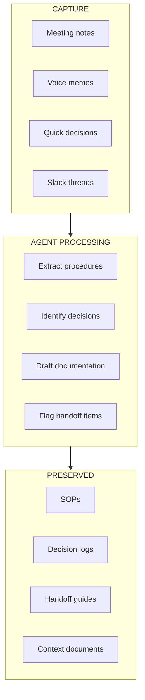

Team leads are the critical interface between institutional knowledge and incoming cohorts. FRAMES provides tools that reduce their burden while capturing the knowledge that would otherwise be lost.

---

## The Team Lead Problem

Team leads in university engineering programs are responsible for everything:

- **Technical work** — Actually building the mission hardware and software
- **Training** — Getting new members up to speed
- **Documentation** — Recording decisions, procedures, and rationale
- **Coordination** — Managing interfaces with other subsystems
- **Handoffs** — Transferring knowledge when people leave

This is unsustainable. Something has to give—and usually it's documentation. Critical knowledge stays in heads, handoffs are incomplete, and the next cohort reinvents solutions to already-solved problems.

---

## The Team Lead Workspace

FRAMES provides a Notion-based workspace designed for how team leads actually work:

### Capture Without Extra Work

Team leads don't have time for separate documentation tasks. The workspace integrates with existing workflows:

| Input | What Gets Captured |
|-------|-------------------|
| **Meeting notes** | Decisions, action items, rationale |
| **Slack/Teams messages** | Quick decisions, problem-solving approaches |
| **GitHub activity** | What changed, why, who was involved |
| **Voice memos** | Thoughts captured on the fly |

### Agent-Assisted Documentation

[AI agents](/Portfolio/agents/) help transform raw input into useful documentation:

1. **Draft SOPs** from described procedures
2. **Extract decisions** from meeting notes
3. **Identify handoff items** from departure timelines
4. **Flag undocumented knowledge** before people leave

Everything is staged for human review—agents propose, leads approve.

---

## Handoff Management

When team members leave, FRAMES helps ensure knowledge transfers:

```mermaid
flowchart LR
    subgraph DETECT["DETECT"]
        D1["Departure announced"]
        D2["Agent scans activities"]
        D3["Knowledge map generated"]
    end
    
    subgraph PLAN["PLAN"]
        P1["Handoff checklist created"]
        P2["Overlap period scheduled"]
        P3["Successor identified"]
    end
    
    subgraph EXECUTE["EXECUTE"]
        E1["Knowledge sessions tracked"]
        E2["Documentation reviewed"]
        E3["Competency validated"]
    end
    
    subgraph VERIFY["VERIFY"]
        V1["Gaps identified"]
        V2["Follow-up scheduled"]
        V3["Handoff complete"]
    end
    
    DETECT --> PLAN --> EXECUTE --> VERIFY
```

### Handoff Checklist

When someone announces they're leaving, FRAMES generates a checklist based on their activities:

- What they've been working on
- Who depends on their work
- What documentation exists (and what's missing)
- Recommended handoff sessions

### Knowledge Gap Detection

Agents identify when critical knowledge isn't being transferred:

- Activities with no successor involvement
- Documentation that hasn't been reviewed by replacement
- Competencies that haven't been validated

---

## Decision Documentation

Technical decisions need context. FRAMES helps capture not just *what* was decided, but *why*:

| Field | Purpose |
|-------|---------|
| **Decision** | What was decided |
| **Context** | What situation prompted this |
| **Options considered** | What alternatives were evaluated |
| **Rationale** | Why this option was chosen |
| **Implications** | What this affects downstream |
| **Stakeholders** | Who was involved, who needs to know |

This context is what gets lost when people leave—and what causes future teams to make the same mistakes or revisit settled questions.

---

## Risk Visibility

The workspace surfaces risks that team leads might not see:

### Knowledge Concentration

See when expertise is too centralized:

- "Only Maria understands the power subsystem"
- "All thermal design knowledge leaves in May"
- "No documentation exists for the deployment mechanism"

### Interface Degradation

Track when connections between teams weaken:

- Meetings that stopped happening
- Communication channels that went quiet
- Handoff checkpoints that were skipped

### Upcoming Transitions

Plan for predictable disruptions:

- Who's graduating this semester
- Which roles don't have successors
- What knowledge hasn't been transferred

---

## For Administrators

Aggregate team lead data across your program:

| Insight | Value |
|---------|-------|
| **Documentation health** | Which teams are capturing knowledge, which aren't |
| **Handoff status** | Are transitions being managed or neglected |
| **Risk distribution** | Where are single points of failure |
| **Workload indicators** | Are team leads overwhelmed |

[Learn more about FRAMES for Administrators →](/Portfolio/administrators/)

---

## Integration

The Team Lead Workspace integrates with tools teams already use:

| Platform | Integration |
|----------|-------------|
| **Notion** | Primary workspace—templates, databases, pages |
| **GitHub** | Automatic activity tracking |
| **Slack/Teams** | Optional message capture (with consent) |
| **Calendar** | Meeting detection and scheduling |

---

## Technical Details

For implementation details and integration guides:

[See Technical Documentation →](/Portfolio/technical/)
