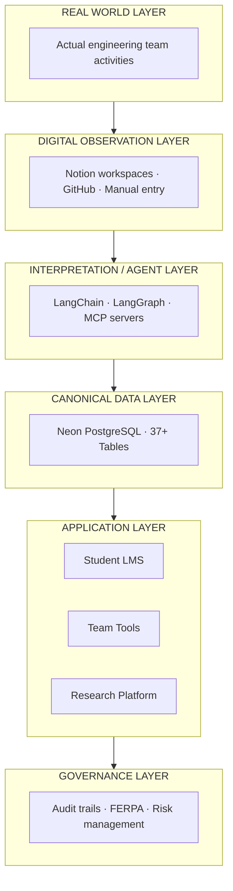
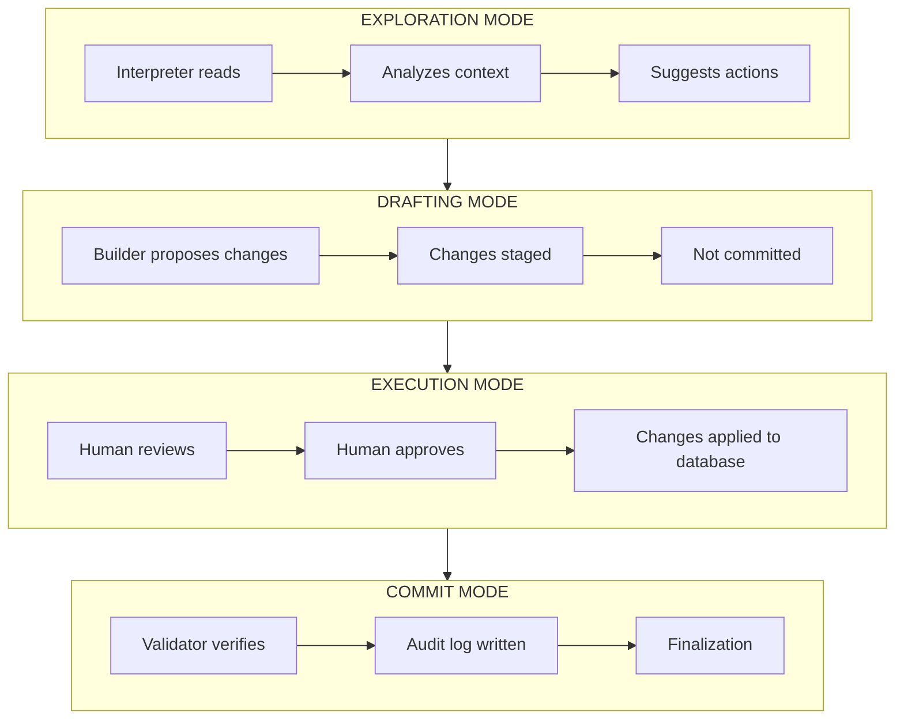
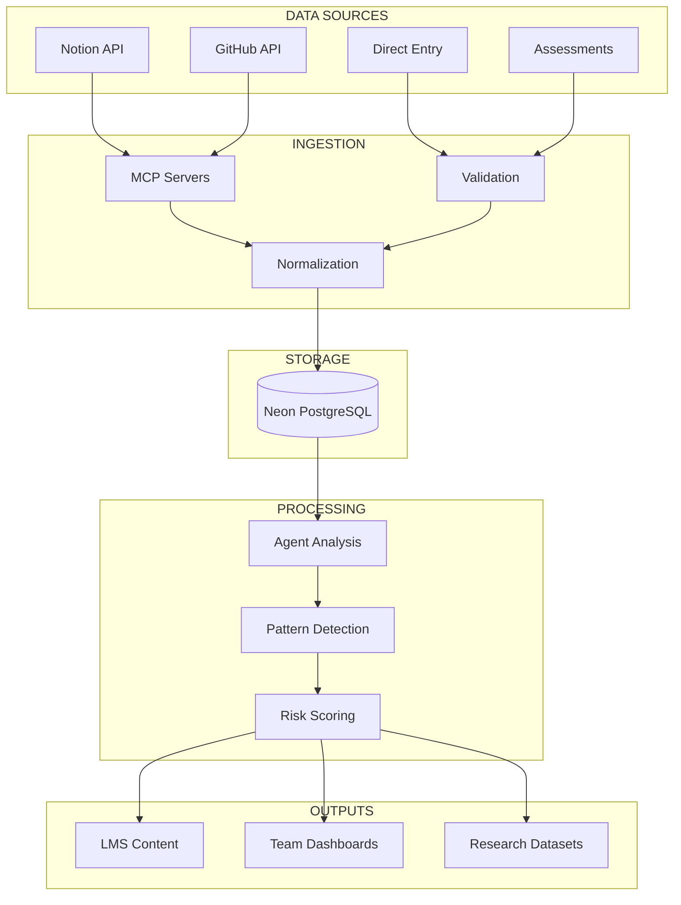

FRAMES is built on a six-layer architecture designed to instrument complex engineering teams, map organizational structure, and identify risk factors that predict mission success or failure. This page provides the technical details.

---

## System Architecture



---

## Layer Details

### Layer 1: Real World Layer

Where authentic engineering activities occur—design reviews, code commits, team meetings, technical decisions. FRAMES observes without interfering with natural workflows.

### Layer 2: Digital Observation Layer

Captures team activities through digital touchpoints:

| Source | Data Captured |
|--------|---------------|
| **Notion** | Documentation, decisions, meeting notes, handoffs |
| **GitHub** | Code commits, issues, pull requests, collaboration patterns |
| **Manual Entry** | Structured observations, assessments, surveys |

### Layer 3: Interpretation / Agent Layer

AI agents that interpret observations and support team operations:

| Agent | Role | Autonomy Level |
|-------|------|----------------|
| **Alpha** | Read-only analysis and pattern recognition | None — observation only |
| **Beta** | Draft suggestions for human review | Low — proposes, doesn't act |
| **Gamma** | Controlled actions with human approval | Medium — acts within constraints |

#### Workflow Orchestration (LangGraph)



#### MCP Server Integration

Model Context Protocol servers provide secure, controlled access to external systems:

| MCP Server | Purpose | Risk Surface |
|------------|---------|--------------|
| **Notion** | Read team documentation | Low |
| **GitHub** | Read repositories, issues | Low |
| **Filesystem** | Access local resources | Medium |
| **PostgreSQL** | Database operations | High (gated) |

### Layer 4: Canonical Data Layer

Single source of truth using **Neon PostgreSQL** with 37+ tables:

| Domain | Tables | Purpose |
|--------|--------|---------|
| **Organizations** | universities, teams, programs | Institutional structure |
| **People** | users, roles, permissions | Identity and access |
| **Missions** | missions, phases, milestones | Project tracking |
| **Learning** | modules, steps, assessments | Educational content |
| **Analytics** | events, metrics, reports | Research data |

### Layer 5: Application Layer

Three distinct applications:

| Application | Audience | Technology |
|-------------|----------|------------|
| **Student LMS** | Individual contributors | React 18+ PWA |
| **Team Lead Workspace** | Program managers | Notion integration |
| **Research Platform** | Researchers | Jupyter + MLflow + Superset |

### Layer 6: Governance Layer

All operations logged and auditable:

- FERPA compliance for educational data
- Role-based access control
- Audit trails for all agent actions
- Circuit breakers for runaway operations

---

## Data Flow



---

## Technology Stack

| Layer | Technologies |
|-------|--------------|
| **Frontend** | React 18+, TypeScript, PWA |
| **Backend** | Flask 3.0, Python 3.9+ |
| **Database** | Neon PostgreSQL 15+ |
| **AI/ML** | LangChain, LangGraph, OpenAI GPT-4 |
| **Research** | Jupyter, MLflow, Apache Superset |
| **Infrastructure** | Docker, GitHub Actions |

---

## API Overview

RESTful API endpoints:

| Endpoint | Purpose |
|----------|---------|
| `/auth` | Authentication |
| `/users` | User management |
| `/teams` | Team operations |
| `/missions` | Mission tracking |
| `/modules` | Learning content |
| `/assessments` | Evaluations |
| `/analytics` | Research queries |
| `/agents` | AI operations |
| `/governance` | Audit and compliance |

---

## Getting Started

### Prerequisites

- Python 3.9+
- Node.js 18+
- PostgreSQL 15+ (or Neon account)
- Docker 24+ (recommended)

### Repository

```bash
git clone https://github.com/Lizo-RoadTown/FRAMES-Python.git
cd FRAMES-Python
```

### Environment Setup

```bash
# Create virtual environment
python -m venv venv
source venv/bin/activate  # or venv\Scripts\activate on Windows

# Install dependencies
pip install -r requirements.txt

# Configure environment
cp .env.example .env
# Edit .env with your credentials
```

---

## Contact

**Project Lead:** Elizabeth Osborn  
**Email:** [eosborn@cpp.edu](mailto:eosborn@cpp.edu)  
**Repository:** [github.com/Lizo-RoadTown/FRAMES-Python](https://github.com/Lizo-RoadTown/FRAMES-Python)

